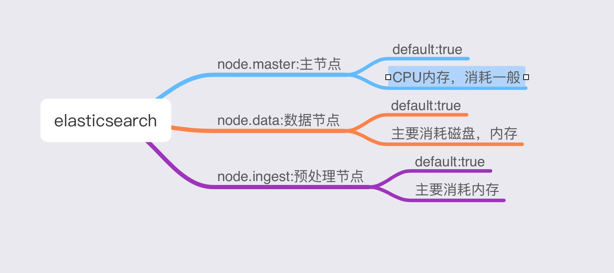

# 聊聊elasticsearch(ES)节点角色的作用

## ES节点分类
ES节点角色主要分为三类：node.master(主节点)，node.data(数据节点)，node.ingest(预处理节点)。
默认情况下，ES 集群中每个节点都有成为主节点的资格，也都存储数据，还可以提供查询服务，但是使用默认配置在高数据量，高并发的场景下集群容易出现一些莫名其妙的问题，所以我们在生产环境要根据业务需要把每个节点配置为合适的角色。

### 主节点
ES默认配置node.master为true，但是并不是说这个节点就是主节点，真正的主节点需要集群投票选举产生，所以这个配置为true只代表这个节点有被选举为主节点的资格。
### 数据节点
ES默认配置node.data为true，这个属性表示节点是否存储数据。
### 预处理节点
ES默认配置node.ingest为true，这个属性表示节点在索引文档数据之前可以做一些预处理，如果数据经常需要预处理，则应设置专门的预处理节点。(建议将数据存入ES集群之前做好预处理，推荐使用logstash)

为了在 indexing（索引）之前预处理 documents（文档）。您可以定义一个指定了一系列的 processors（处理器）的 pipeline（管道）。每个 processors（处理器）以某种方式转换文档。例如，您可能有一个 pipeline（管道），其中包含一个 processor，该 processor 从文档中删除一个 field（字段），然后接着一个用于重命名 field（字段）的 processor（处理器）。

## 推荐5种ES节点角色常用组合配置

### NO.1
```ruby
node.master: true
node.data: true
node.ingest: true
```
这个组合表示这个节点既有成为主节点的资格，又可以存储数据，还可以作为预处理节点。如果此节点被选为主节点，那么此节点的负载将会比较高，因此，测试环境可以这么干，但是生产环境最好不要选此组合。

### NO.2
```ruby
node.master: false
node.data: true
node.ingest: false
```
这种组合表示这个节点没有成为主节点的资格，也就不参与选举，只会存储数据。这个节点我们称为 data(数据)节点。在集群中需要单独设置几个这样的节点负责存储数据。后期提供存储和查询服务。

### NO.3
```ruby
node.master: true
node.data: false
node.ingest: false
```
这种组合表示这个节点不会存储数据，有成为主节点的资格，可以参与选举，有可能成为真正的主节点。这个节点我们称为master节点。

### NO.4
```ruby
node.master: false
node.data: false
node.ingest: true
```
这种组合表示这个节点即不会成为主节点，也不会存储数据。这种节点的意义就是在索引和搜索阶段进行文档预处理。加入集群对预处理依赖不强，则可不单独设置此类节点。

### NO.5
```ruby
node.master: false
node.data: false
node.ingest: false
```
这个组合表明此节点为纯查询模式，即节点只接受查询请求，对于查询数据量比较大的集群，配置这种节点可以有效的保护数据节点，防止一个大查询把数据节点搞得内存溢出。如果经常需要聚合操作，则建议多分配一些内存。

## 总结一下
由于ES的默认配置会使一个节点兼有三种角色，因此，在生产环境中我们应该对每个节点的职责进行划分，建议将至少三个节点配置为组合NO.3，这样如果一个master挂了，集群可以投票再选举一个master。
另外还要设置一批节点为数据节点，为了不给数据节点增加太大负担，还需设计几个查询节点(NO.5)
文档的预处理最好放在入ES集群之前做，否则需要配置几台预处理节点，专门处理文档的清洗。