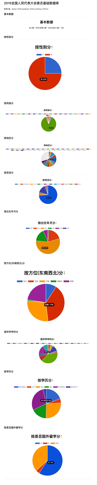

## 趁着开全国人民代表大会刷一波热点
哈哈，趁着开全国人民代表大会刷一波热点，基础数据来源于网络。另外项目源代码请移步：[npc][https://github.com/sun1752709589/npc]
源代码中包含了基础数据，csv格式和sql格式，因此有兴趣的同学可以直接导入数据库。项目采用rails编写，只用了不到一个小时就完成了，在此再次感叹rails的强大，真心希望ruby和rails发展的越来越好，越来越多的人采用它。

## 代表们的信息统计结果
