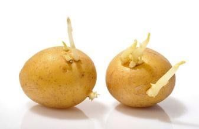
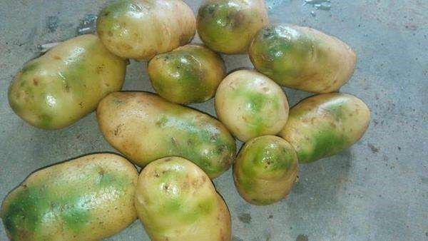

# 今天聊一聊发芽的土豆(山药蛋,马铃薯)到底能不能吃？
今天晚上做饭时，想起了很早之前买的土豆，于是就打算来个醋溜土豆丝，等拿过来打算洗干净时，发现这土豆已经长了约半厘米长的芽，这时想起了一个常识：发芽的土豆不能吃。但是到底为啥不能吃呢，今天就给大家说道说道。

## 为啥土豆发芽了不能吃了？
因为发芽的土豆有毒，马铃薯发芽后，芽周围的龙葵碱含量会大幅增加。这里需要说明，`虽然产生青色的物质不是龙葵碱，但“变青”是龙葵碱产生的标志。龙葵碱是一种神经毒素，人摄入过多会引发呕吐、腹泻等症状，严重时甚至威胁生命。`
这是马铃薯在进化过程中形成的一种自我保护机制，保护其不被动物取食。

所以！

在芽不多，青色部位不大，而且马铃薯还比较硬的情况下，彻底去除发芽和青色部位后，充分加热或加些醋一起烹制（有助于破坏龙葵素），食用起来不会有什么问题。

如果发芽或变青比较严重（如下图），或者已经变软，则应当扔掉，不能再食用了。

这种属于芽已经很大很多的，千万不要吃！

这种属于变青比较严重的，也千万不要吃！