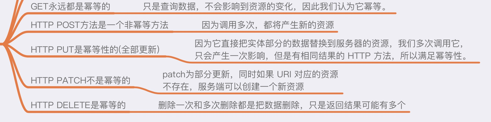
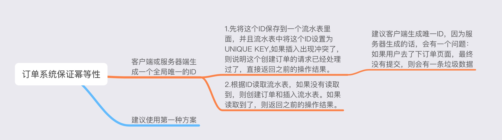

# 聊聊接口幂等性及其解决方案

## 首先来聊聊幂等性的概念
即一个幂等操作的特点是其任意多次执行所产生的影响均与一次执行的影响相同。说白了，就是一个接口，我调用一次和调用n次之后对服务器资源产生的影响是一样的，不会因为客户端调用次数不同而产生的影响不同。

## HTTP各个请求方法幂等性剖析

## 创建订单实现幂等的一点建议
如果一个用户分两次下单，购买的商品都是一样的：

第一次请求：user1：购买一个商品product1；

第二次请求：user1：还是购买一个商品product1；

这种情况大部分有订单系统的项目都会很常见，如果没有做幂等性的保证，那么可能得后果就是生成了二个一模一样的订单。

对于这种订单接口不支持幂等的情况下，如何应付这种情况呢？
推荐一种比较靠谱又常见的解决方案：
可以使用一个唯一的流水号ID，用来标识是不是同一个请求或者交易。这种ID通常都需要具备全局唯一性。假设让客户端来生成这个ID，每个创建订单的请求生成一个唯一的ID。那么订单系统如何根据来实现幂等呢？服务器端通常有两种方案可供采用：

## 分布式系统如何保证幂等性
可参考文章：[美团分布式系统互斥性与幂等性问题的分析与解决](https://tech.meituan.com/2016/09/29/distributed-system-mutually-exclusive-idempotence-cerberus-gtis.html)

## 总结
幂等性应该是合格程序员的一个基因，在设计系统时，是首要考虑的问题，尤其是在像支付宝，银行，互联网金融公司等涉及的都是钱的系统，既要高效，数据也要准确，所以不能出现多扣款，多打款等问题，这样会很难处理，用户体验也不好。