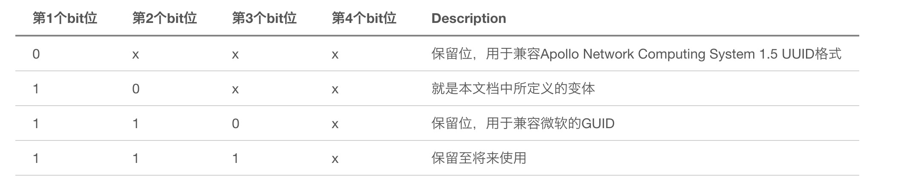
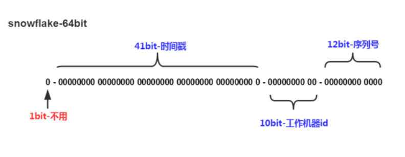

# UUID的版本和各自优缺点

## 简介
UUID(Universally Unique Identifier)通用唯一识别码，UUID出现的目的，是为了让分布式系统可以不借助中心节点，就可以生成UUID来标识一些唯一的信息。GUID(Globally Unique Identifier)全局唯一识别码，跟UUID是同一个东西，微软搞得。

## 不同版本简介
UUID本身也经过了多个版本的演化，每个版本的算法都不一样。
标准格式：xxxxxxxx-xxxx-Mxxx-Nxxx-xxxxxxxxxxxx

分为五段，形式为8-4-4-4-12的32个字符

M那个位置，代表版本号，由于UUID的标准实现有5个版本，所以只会是1,2,3,4,5

N那个位置，只会是8,9,a,b，表示 UUID 变体

N字段有四种定义，那如果是由rfc4122所定义的UUID格式的话，也就是本文所讨论的，这个字段的取值可以是8，9，a，b，也就是10XX(二进制)。我们来看下N有哪些取值。


### 版本1：基于时间的UUID
通过当前时间戳、机器MAC地址生成。
1. 保证全球唯一性
2. 暴露了电脑的MAC地址和生成时间
```python
>>> import uuid
>>> uuid.uuid1()
UUID('0dc5b462-4b03-11e9-8883-645aede903e7')
```
最后的12个字符`645aede903e7`是我电脑网卡的MAC地址

### 版本2：DCE安全的UUID
和基于时间的UUID算法相同，但会把时间戳的前4位置换为POSIX的UID或GID。基本上所有的UUID实现都不会实现这个版本。

### 版本3：基于名字空间的UUID(MD5)
用户指定1个namespace和1个具体的字符串，通过MD5散列，来生成1个UUID。
```python
>>> import uuid
>>> uuid.uuid3(uuid.NAMESPACE_DNS, "testUUID")
UUID('376b2fb2-3b52-3748-9910-03337e96b2c6')
>>> uuid.uuid3(uuid.NAMESPACE_DNS, "testUUID2")
UUID('39baf37b-3c20-3005-adeb-b5057ba56cf9')
>>> uuid.uuid3(uuid.NAMESPACE_DNS, "testUUID")
UUID('376b2fb2-3b52-3748-9910-03337e96b2c6')
```

### 版本4：基于随机数的UUID
根据随机数，或者伪随机数生成UUID。
1. 有碰撞的概率
2. 大家用得最多的版本
```python
>>> import uuid
>>> uuid.uuid4()
UUID('ce3f1f3a-4160-4c17-a373-8aabbbd533a5')
或者ruby中：
pry(main)> import 'securerandom'
pry(main)> SecureRandom.uuid
=> "f4d4bed8-1d78-402b-b414-66dcc17d2052"
```

### 版本5：基于名字空间的UUID(SHA1)
和版本3一样，只是散列函数换成SHA1。
```python
>>> import uuid
>>> uuid.uuid5(uuid.NAMESPACE_DNS, "testUUID")
UUID('7442cf28-372f-58e0-a798-1804187a4395')
>>> uuid.uuid5(uuid.NAMESPACE_DNS, "testUUID2")
UUID('a027e5d8-c884-588a-90e6-1be7093a70c4')
>>> uuid.uuid5(uuid.NAMESPACE_DNS, "testUUID")
UUID('7442cf28-372f-58e0-a798-1804187a4395')
```

## Twitter的snowflake算法
snowflake是Twitter开源的分布式ID生成算法，结果是一个long型的ID。其核心思想是：使用41bit作为毫秒数，10bit作为机器的ID（5个bit是数据中心，5个bit的机器ID），12bit作为毫秒内的流水号（意味着每个节点在每毫秒可以产生 4096 个 ID），最后还有一个符号位，永远是0。
1. 毫秒数在高位，自增序列在低位，整个ID都是趋势递增的。
2. 不依赖数据库等第三方系统，以服务的方式部署，稳定性更高，生成ID的性能也是非常高的。
3. 可以根据自身业务特性分配bit位，非常灵活。
4. 强依赖机器时钟，如果机器上时钟回拨，会导致发号重复或者服务会处于不可用状态。(缺点)


另外Mongdb数据库的objectID可以算作是和snowflake类似方法，通过【时间+机器码+pid+inc】共12个字节，通过4+3+2+3的方式最终标识成一个24长度的十六进制字符。

## 拓展阅读：美团点评分布式ID生成系统
[美团点评分布式ID生成系统](https://tech.meituan.com/2017/04/21/mt-leaf.html)