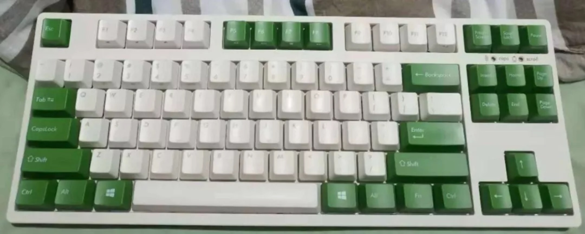
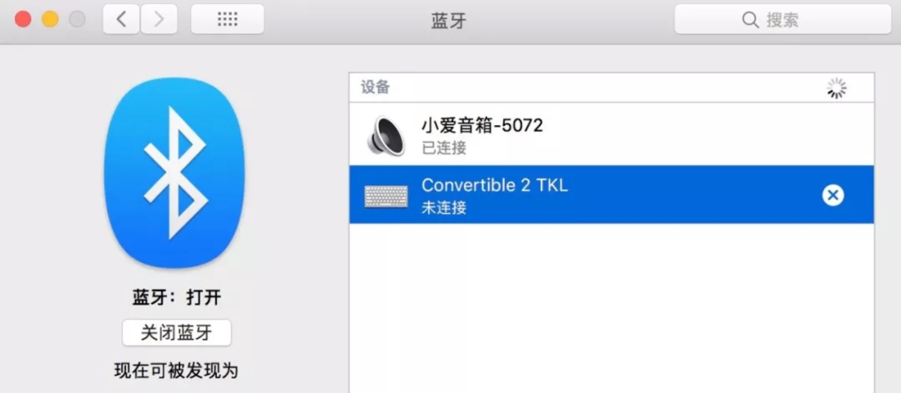
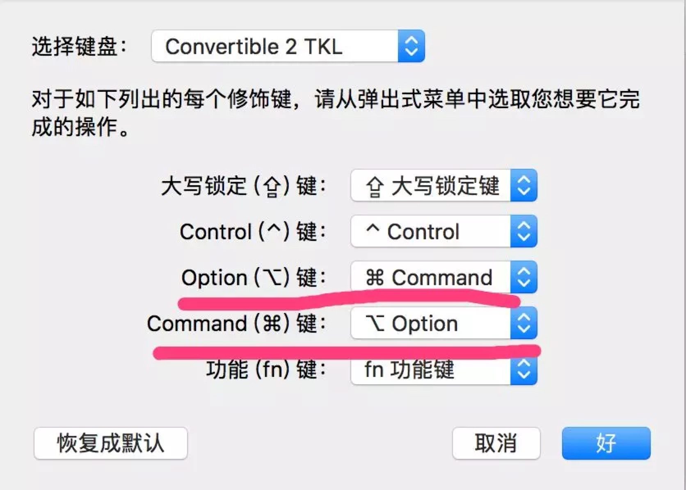
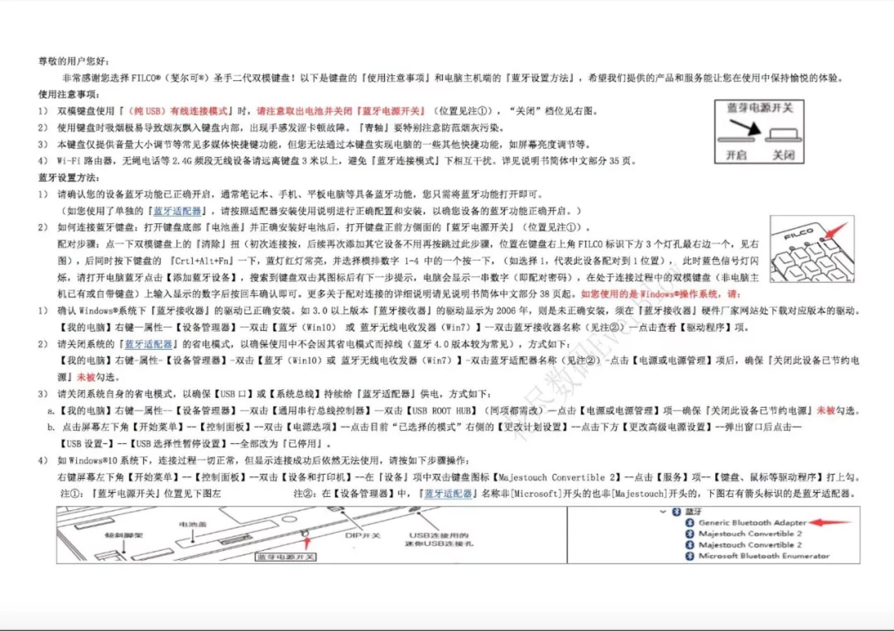

# FILCO蓝牙机械键盘之重新配置
首先来张图压压场！笔者的这款键盘为【斐尔可（FILCO）FKBC87M/EWG2「87双模圣手二代」蓝牙无线键盘 樱桃机械键盘 奶白色绿键帽 茶轴 】

记得刚买上蓝牙机械键盘时，配置蓝牙时琢磨了好半天（你懂的是日文说明书），这次由于要换电脑，又在网上找了半天的说明书，为了避免这种重复劳动，今天决定将教程记录下来。

## 1.蓝牙键盘恢复出厂设置：
很简单，将背面的小按钮长按三秒。如下图：

这样，你之前已经配对的所有设备都会清楚掉，然后你就可以进入下面的流程啦。
其实蓝牙键盘一般都支持4个记忆设备，所以当你已经没有新的槽位可以使用时才需要恢复出厂设置。

## 2.蓝牙键盘和电脑配对，以Mac为例：
打开电脑蓝牙搜索框，然后在蓝牙键盘上同时按Ctrl+Alt+Fn，这时蓝牙键盘上相应的指示灯会闪亮，这时在蓝牙键盘上按1，2，3，4中的任意一个键（将此电脑配对到键盘上的那个槽位），这时注意观察电脑的蓝牙搜索框，会出现陌生设备。如下图：

当出现时点击配对即可，这时系统会提示在蓝牙键盘上输入随机的6个数字，输入完毕即配对成功。

## 3.配置电脑修饰键：
个人喜好，在Mac的系统设置->键盘->修饰键中将Command键和Option键互换。仅适用Mac电脑，Win系统可自行研究。

## 最后附上在网上找到的filco蓝牙机械键盘配置教程

## JD购买地址(应该已经停止出售了)
[JD购买地址](https://item.jd.com/5503484.html)

