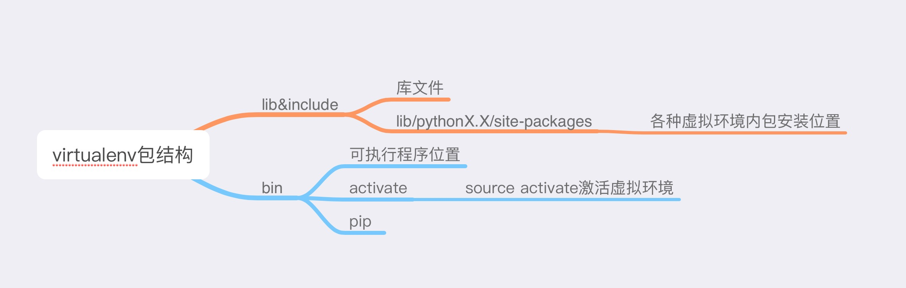

# python虚拟环境virtualenv的安装和使用
如果你正在使用Python3，虚拟环境已经成为内置模块，所以下面分二部分讲解使用python3自带的和单独安装使用virtualenv

## 使用python3的自带的virtualenv
python3 -m venv py1

使用这个命令来让Python运行venv包，它会创建一个名为venv的虚拟环境。 命令中的第一个venv是Python虚拟环境包的名称，第二个py2是要用于这个特定环境的虚拟环境名称。

source ./bin/activate

此命令为激活虚拟环境。

deactivate

用此命令退出当前虚拟环境。

## 使用独立的virtualenv包
首先需要安装：pip install virtualenv

创建虚拟环境：virtualenv py2

其他的操作都和上面的相同。

## virtualenv生成的文件夹结构

## virtualenv和pyenv结合使用(pyenv-virtualenv)
首先需要安装pyenv，安装方式可参考【[手把手教你安装python版本管理工具pyenv](../27/how_install_pyenv.md)】。之后以插件形势安装pyenv-virtualenv

1. git clone https://github.com/pyenv/pyenv-virtualenv.git ~/.pyenv/plugins/pyenv-virtualenv
2. echo 'eval "$(pyenv virtualenv-init -)"' >> ~/.bashrc
3. exec "$SHELL" 或者 退出重新进入bash

[pyenv-virtualenv基本使用](https://github.com/pyenv/pyenv-virtualenv)