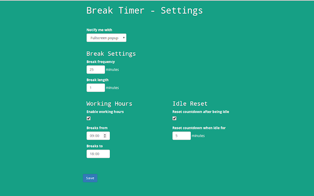

# 程序猿护眼神器推荐之【Break Timer】
笔者因为每天盯着电脑，导致每天眼睛感觉特别累，因此想找一个提醒自己定时休息的软件，最后发现了这个基于chrome的插件，推荐给大家。`爱护眼睛，从我做起，从每天做起！`

## 软件截图

## chrome插件下载地址
[chrome插件地址](https://chrome.google.com/webstore/detail/break-timer/hklkdbpicdmlpoiellngedpejjkmapei?utm_source=chrome-ntp-icon)
