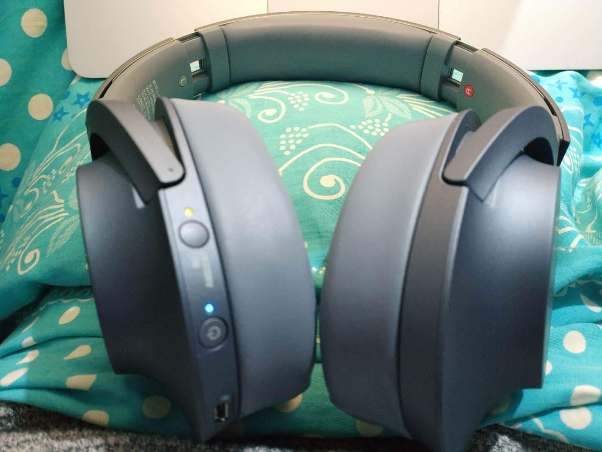
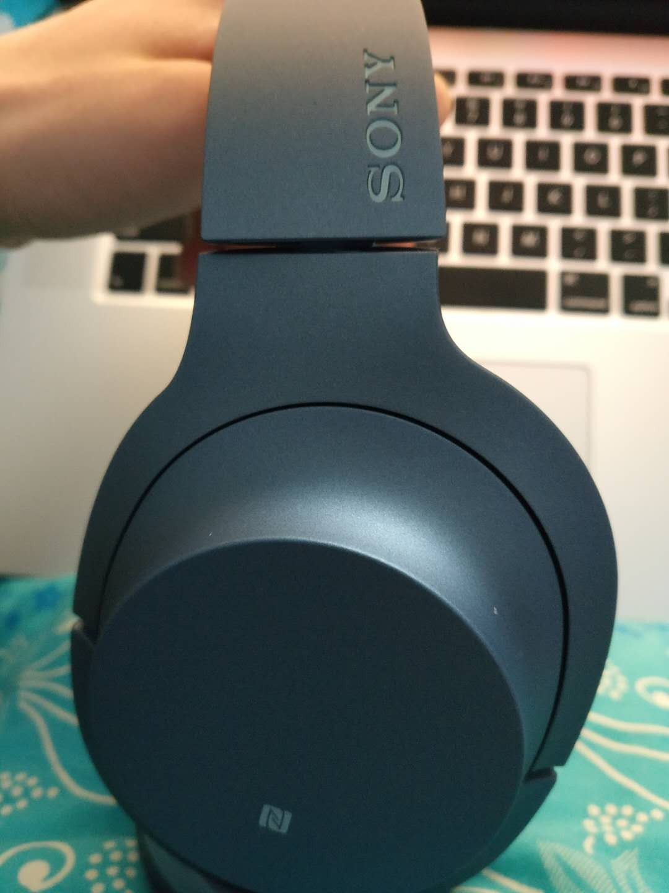
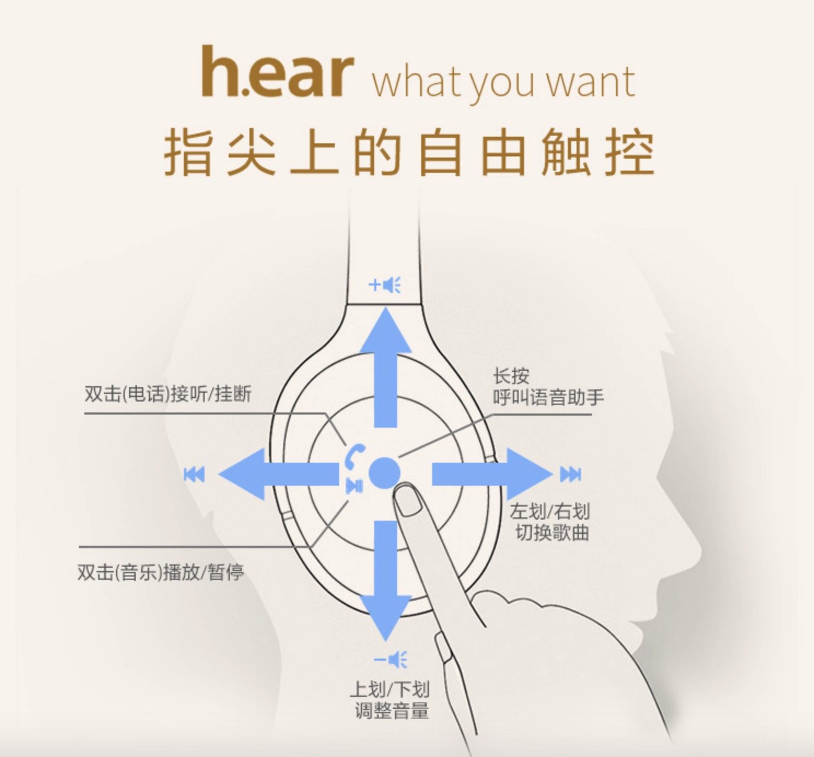
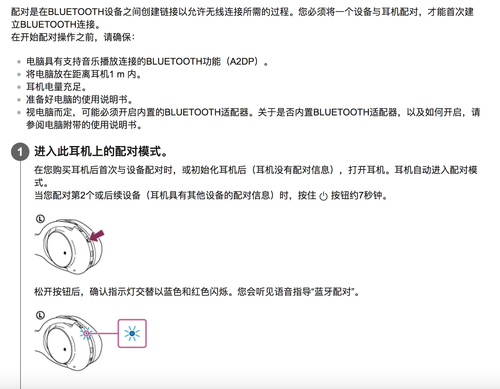
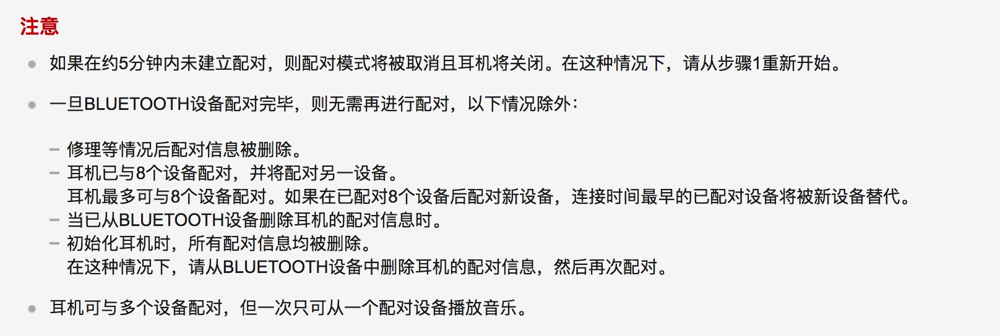
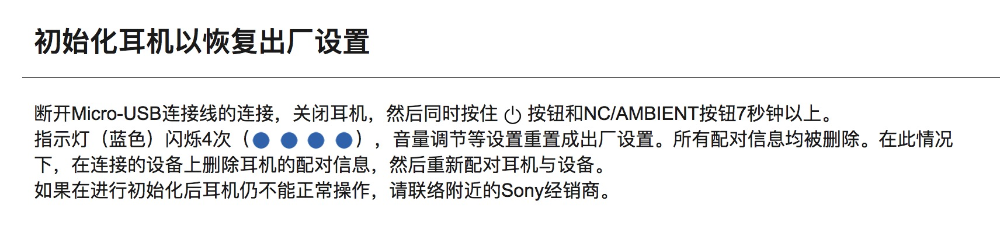

# Sony WH-H900N蓝牙耳机使用教程
笔者前几天刚入手了这个型号的蓝牙耳机，先谈使用体验：数字降噪中等，对杂音降噪还可以，但是对人说话基本不起作用，在地铁上的戴的话效果还是很不错的。价格：笔者在JD买的，因为是plus会员，习惯了在JD买自营，入手价1399，价格算中等吧。做工：没的说，非常漂亮！续航：28小时，不开降噪的话会更长，基本够使用一个星期。充点10分钟可使用65分钟。下面来二张图：

正面：

侧面：

## 右面触控板的使用

## 蓝牙配对及注意事项

蓝牙配对：

配对注意事项：

## 恢复出厂设置

## 更详尽的使用指南
[官方使用指南](https://helpguide.sony.net/mdr/whh900n/v1/zh-cn/index.html)
