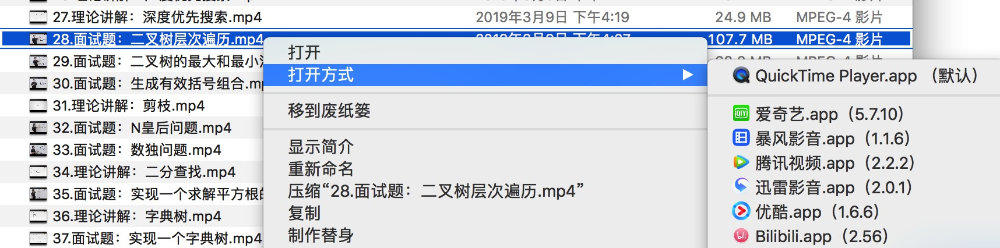
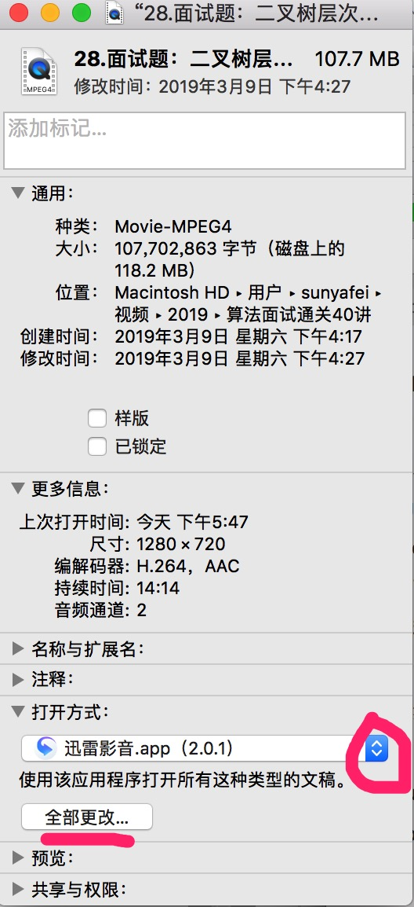
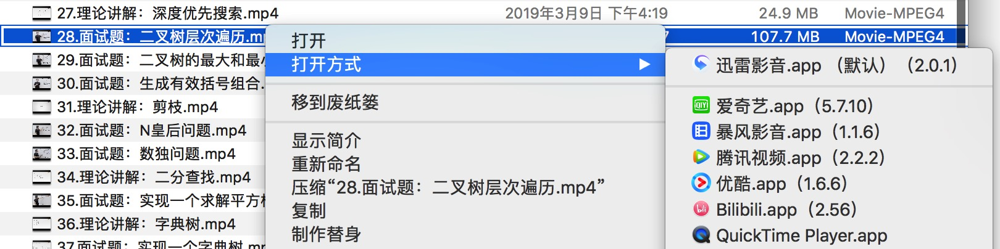

# 如何设置macOS系统的默认打开方式
最近在看一系列视频，但是每次默认打开方式都是Quick Time，想修改为其他的，用过右键->打开方式->其他这种方式老是修改不成功，今天终于知道怎么设置了，因此做一下记录。

## 旧有的默认打开方式以mp4示例
系统默认的打开方式一般很少是我们想要的，但是每次都用右键，打开方式选择会很麻烦而且浪费时间。

## 如何修改默认打开方式
1. 选择视频，右键，然后选择显示简介；或者直接按Command+i
2. 找到打开方式选项，选择想要的打开方式，点击【全部更改】


再次用右键，查看默认打开方式：

## 参考
[百度经验](https://jingyan.baidu.com/article/92255446ad880b851648f4a5.html)
