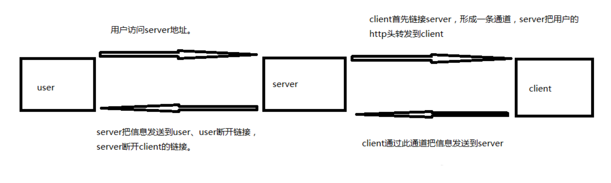
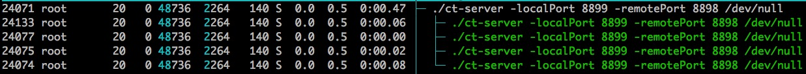
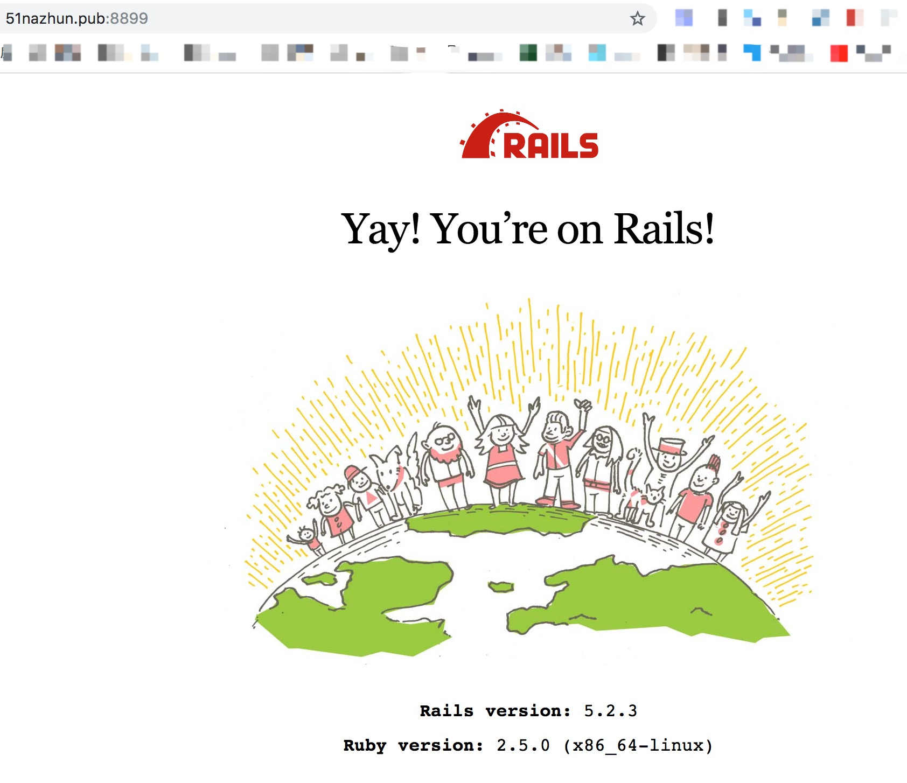

# 手把手教你搭建自己的内网穿透服务
笔者之前用过[ngrok](https://ngrok.com)，很好用，但是有一个小缺点：就是每次重启后域名会变，只有pro版才支持不变的域名。于是笔者转向寻找开源的自主可控的内网穿透服务。偶然间看到码云上的一个项目[chuantou](https://gitee.com/NASA66688/chuantou)笔者发现这就是我一直寻找的东西，开搞！

## 内网穿透的应用场景
* 搞过支付的人都知道，等用户付了款之后的回调，如果我想在我自己的开发机器上调试，这时就是内网穿透显身手的时候了。
* 搞过微信那一堆的应该也需要，微信支付啥的
* oauth2.0里面好像越有个啥callback_url
* 自己用得着的其他地方......
* 一句话：`内网穿透，可以让全世界访问家用电脑里的网站。`

## 原理：client运行在家用电脑，内装有自己的网站。user为访问网站的浏览器。


## 此开源穿透服务的特点(笔者最看重自主可控这个特点)
1、多协程并发管理多个tcp链接。速度更快。

2、加入心跳包机制（20秒）。应对拔网线等极端情况

3、自定义服务器与家用电脑的监听端口

4、支持断线重连，如果没收到心跳包或者网断了会自动重连

5、server端基本不需要关闭，如需要重启可以只重启客户端（client）

6、本版本为重构版本，不需要引入额外的包，只需两个文件。代码清晰易懂，并加入大量释

## 具体操作步骤
你本地需要一台安装go的Mac(最好)电脑，一台安装go的Linux机器，当然你也可以把server.go和client.go编译为二进制扔到机器上。
1. 服务器端运行server.go


localPort端口为用户访问的端口，remotePort端口为与client通讯的端口


服务器端跑起来后的进程

2. 客户端运行client.go

```shell
# 我服务器已经配置了域名：51nazhun.pub
go run client.go -host 51nazhun.pub -localPort 3000 -remotePort 8898
```
localPort端口为家用电脑网站的端口，remotePort端口为与server通讯的端口，与server端设置必须一致！

3. 全世界任何浏览器访问：【51nazhun.pub:8899】即可访问到家用电脑中的网站。

