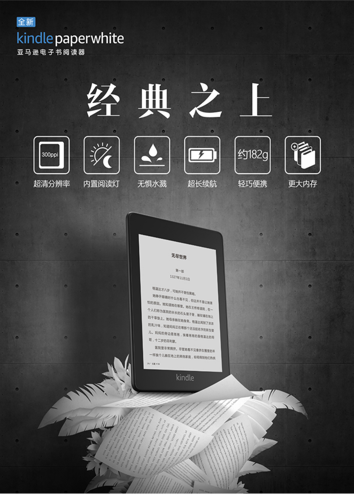
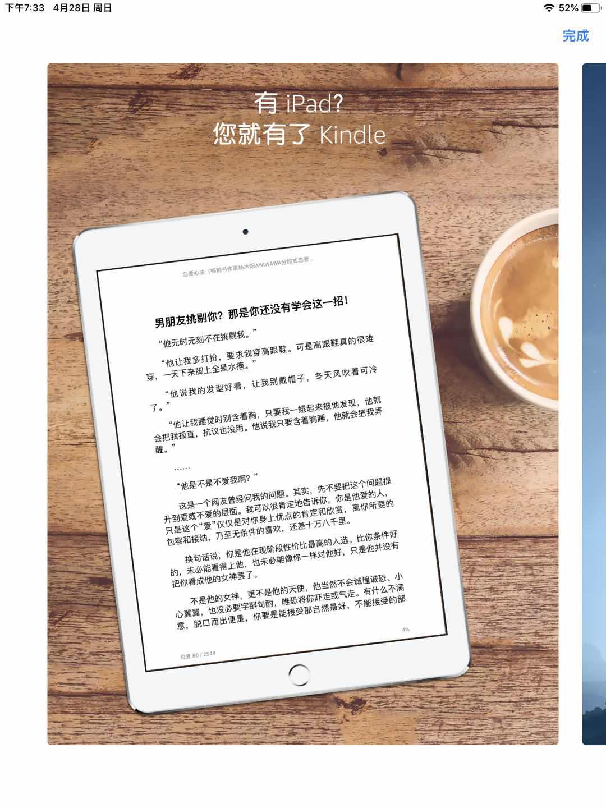
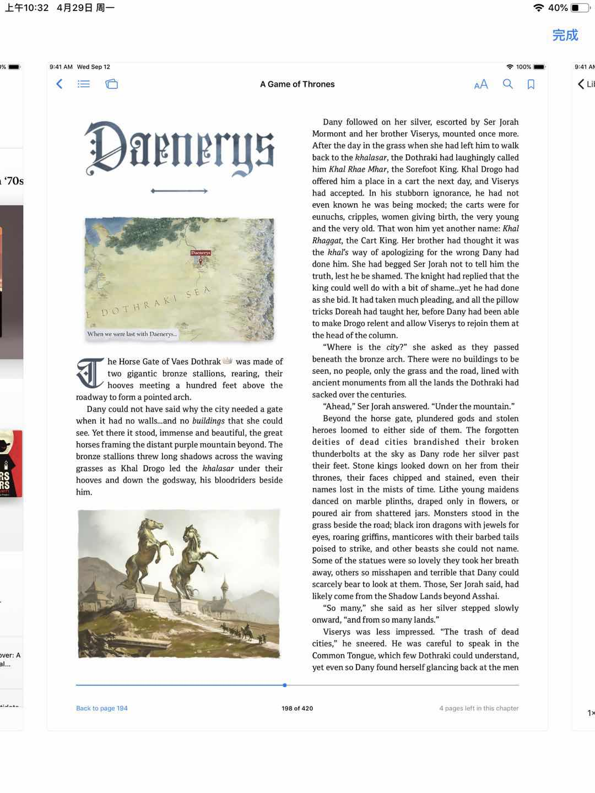

# 读书阅读器推荐
由于每天二个小时的上班路程和二个小时的下班路程使我选择用阅读打发这些时间😂。本人喜欢用iPad mini阅读，为此特地买了最新款iPad mini。阅读体验非常棒👍。特此分享给大家，送给爱读书的小伙伴！搜索电子书请到：[Kindle电子书分享网](https://kindle.51nazhun.pub/)

## 亚马逊的 Kindle paperwhite

购买链接：https://item.jd.com/100000667370.html

## iPad mini + Kindle软件

iPad mini：https://item.jd.com/100004245972.html

APP：https://itunes.apple.com/cn/app/amazon-kindle/id302584613

## iPad mini + IBooks
IBooks支持除mobi格式的绝大部分根式，包括PDF，TXT，EPUB...

## 如何寻找电子书
搜索电子书请到：[Kindle电子书分享网](https://kindle.51nazhun.pub/)。解决找电子书的烦恼！不要下载豆，不要积分，无需注册，更无需回复后查看！