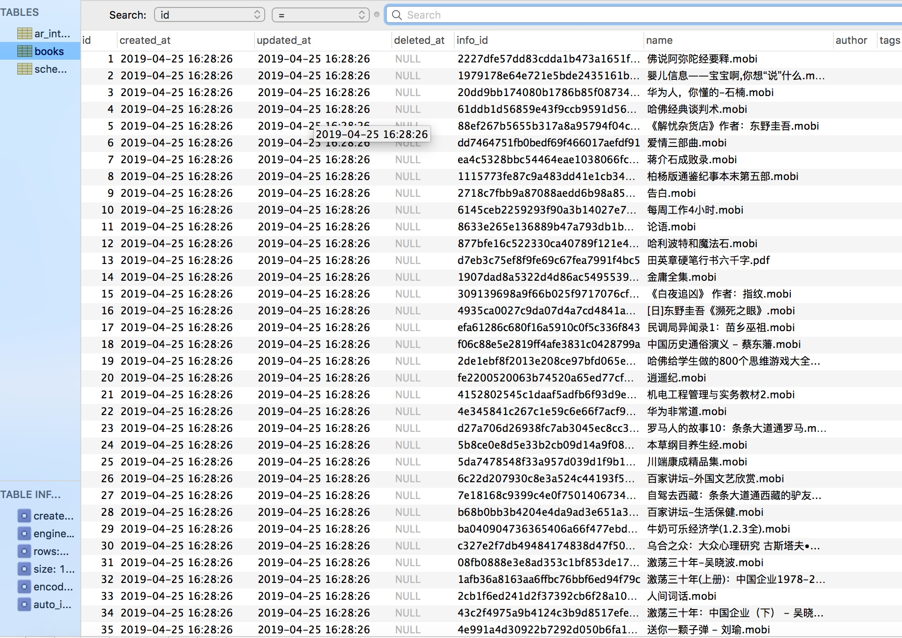
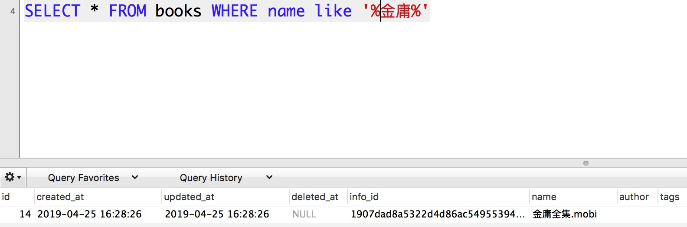

# MySQL全文索引fulltext初探
对于MySQL数据库来说，大部分的查询可以用like完成，百万数据量一般也轻松胜任，但是那不是真正的搜索，充其量算是字符串匹配，而全文索引才是真正的搜索。MySQL从5.7版本对InnoDB存储引擎添加了全文索引的支持，本文就对其进行初探。

## 数据准备
在此我准备了books表，主要对name字段进行全文索引探索。


## 普通索引和基本的like查询
在此我们先回顾一下基本索引的创建和like查询。

首先创建一个btree索引：
```shell
CREATE INDEX name_idx on books(name);
SELECT * FROM books WHERE name like '%金庸%'
SELECT * FROM books WHERE name like '金庸%'
```


在此需要说明的是关键字前后都加`%`使用不到索引的，对此可用explain详细分析。

## 全文索引fulltext及其查询语句
全文索引最关键的一点就是分词，在创建索引是需要进行分词处理。对于英文自不必多说分词很简单，就是按照空格分割。但是对于中日韩文字来说分词却很困难，针对中日韩文字，MySQL提供了一个简单的分词工具---ngram。ngram采用了最简单的分词算法，它将一个句子分成固定字数的短语，比如默认情况下，ngram_token_size的值为2。而从MySQL 5.7.6开始，ngram作为mysql自带的插件，可以直接使用。另外不建议修改ngram_token_size参数的值。

下面我们开始创建全文索引：
```shell
CREATE FULLTEXT INDEX ft_name_index ON books(name) WITH PARSER ngram;
# 基本查询
SELECT * FROM books WHERE MATCH(name) AGAINST ('金庸' IN NATURAL LANGUAGE MODE);
```


```shell
# 多关键字搜索

```


```shell
# 按score排序

```