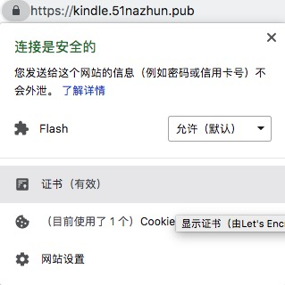

# 使用Let’s Encrypt给网站启用https
现在所有网站都可以利用 Let’s Encrypt(certbot)给自己的网站发放https证书。我自己搭建的网站【Kindle电子书分享网】今天也正式启用了https.这里记录一下Let’s Encrypt的使用和注意事项，以及nginx相关配置和优化。




## 为什么要用https
1. 更安全的连接和传输，保护用户的隐私
2. 在搜索引擎比如谷歌的排名算法中https更靠前
3. 。。。。。。

## 获取证书
首先要把nginx关掉，因为 Let’s Encrypt客户端运行时会占用80端口用来验证域名所有权。

然后记得把服务器443端口打开，服务器的安全组的端口443端口也打开。
```shell
git clone https://github.com/certbot/certbot.git
cd certbot
./certbot-auto certonly -d kindle.51nazhun.pub
```
执行最后一步时会有一个选择题：(推荐选2)
```ruby
How would you like to authenticate with the ACME CA?
- - - - - - - - - - - - - - - - - - - - - - - - - - 
1: Nginx Web Server plugin (nginx)
2: Spin up a temporary webserver (standalone)
3: Place files in webroot directory (webroot)
```
## 配置nginx
话不多说，直接上配置：
```ruby
upstream kindle {
    server 127.0.0.1:8080;
}
server {
    listen 443 ssl;
    ssl_certificate /etc/letsencrypt/live/kindle.51nazhun.pub/fullchain.pem;
    ssl_certificate_key /etc/letsencrypt/live/kindle.51nazhun.pub/privkey.pem;
    server_name kindle.51nazhun.pub;
    location / {
            proxy_pass_header Server;
            proxy_set_header Host $http_host;
            proxy_redirect off;
            proxy_set_header X-Real-IP $remote_addr;
            proxy_set_header X-Scheme $scheme;
            proxy_pass http://kindle;
      }
}
server {
    listen 80;
    server_name kindle.51nazhun.pub;
    return 301 https://$server_name$request_uri; # 将http请求无条件转到https
}
```
配置完后启动nginx：service nginx start

## SSL配置优化：如何提升网站https评级
可以使用https后可以到www.ssllabs.com评测一下网站

https://www.ssllabs.com/ssltest/analyze.html?d=kindle.51nazhun.pub

测试完后发现被评为B,得再优化一下,参考这里:

首先关掉ssl v2和ssl v3支持，这两个有安全问题：
```ruby
ssl_protocols TLSv1 TLSv1.1 TLSv1.2;
```
配置dhparams长度:
```ruby
cd /opt
mkdir dhparam
cd dhparam
mkdir keys
cd keys
openssl dhparam -out dhparams.pem 2048
cd ../
sudo chmod 700 keys
```
新的nginx配置:
```ruby
server{
  listen 443 ssl;
  ssl_protocols TLSv1 TLSv1.1 TLSv1.2;
  ssl_ciphers 'ECDHE-RSA-AES128-GCM-SHA256:ECDHE-ECDSA-AES128-GCM-SHA256:ECDHE-RSA-AES256-GCM-SHA384:ECDHE-ECDSA-AES256-GCM-SHA384:DHE-RSA-AES128-GCM-SHA256:DHE-DSS-AES128-GCM-SHA256:kEDH+AESGCM:ECDHE-RSA-AES128-SHA256:ECDHE-ECDSA-AES128-SHA256:ECDHE-RSA-AES128-SHA:ECDHE-ECDSA-AES128-SHA:ECDHE-RSA-AES256-SHA384:ECDHE-ECDSA-AES256-SHA384:ECDHE-RSA-AES256-SHA:ECDHE-ECDSA-AES256-SHA:DHE-RSA-AES128-SHA256:DHE-RSA-AES128-SHA:DHE-DSS-AES128-SHA256:DHE-RSA-AES256-SHA256:DHE-DSS-AES256-SHA:DHE-RSA-AES256-SHA:AES128-GCM-SHA256:AES256-GCM-SHA384:AES128-SHA256:AES256-SHA256:AES128-SHA:AES256-SHA:AES:CAMELLIA:DES-CBC3-SHA:!aNULL:!eNULL:!EXPORT:!DES:!RC4:!MD5:!PSK:!aECDH:!EDH-DSS-DES-CBC3-SHA:!EDH-RSA-DES-CBC3-SHA:!KRB5-DES-CBC3-SHA';
 
  ssl_prefer_server_ciphers on;
  ssl_session_cache shared:SSL:10m;
  ssl_dhparam /opt/dhparam/keys/dhparams.pem;
  ssl_certificate /etc/letsencrypt/live/kindle.51nazhun.pub/fullchain.pem;
  ssl_certificate_key /etc/letsencrypt/live/kindle.51nazhun.pub/privkey.pem;
  server_name kindle.51nazhun.pub;
}
```
这样再评测就发现已经是A等级了。

## 定期更新SSL证书
由于Let’s Encrypt的证书三个到期，好在官方承诺可以无限期续约，而且给了自动化续约的办法。
```shell
0 0 1 */3 * /root/projects/certbot/certbot-auto renew
# 或者
0 0 1 */3 * /root/letsencrypt/letsencrypt-auto --renew certonly -d kindle.51nazhun.pub
```

## 参考文章
https://www.embbnux.com/2015/12/29/letsencrypt_with_nginx_config_for_wordpress/