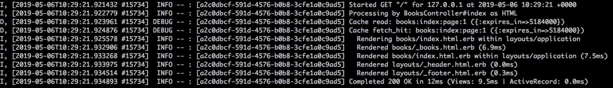
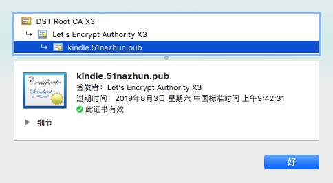

# Kindle电子书分享网技术栈
近期趁工作空闲时间大概不到一周撸了个小网站，目的是解决之前找电子书的烦恼：各种要下载豆，各种要积分，各种需要注册，各种需要回复后查看！
网址：https://kindle.51nazhun.pub/

分享一下主要用到的技术栈，基本都是最新的版本，在此记录一下就当笔记了。

## 主要技术栈
```ruby
ruby: 2.6.3 with --jit # jit
rails: 5.2.3
mysql: 5.7.23 with fulltext index search # 全文索引
bootstrap: 4.3.1 # UI
kaminari: 0.16.3 # 分页
bootstrap4-kaminari-views: 1.0.1 # bootstrap4分页UI
redis: 4.0.1(gem)
redis-server: 5.0.3 # 计数
dalli: 2.7.10 # 缓存
colly: master # go爬虫
```
## ruby jit
参考：https://blog.heroku.com/ruby-just-in-time-compilation
```shell
RUBYOPT=--jit bundle exec puma -e production -p 8000 --pidfile tmp/pids/server.pid -d
```
## MySQL 5.7 Natural Language Full-Text Searches
对于中文使用了mysql一个非常简单的分词工具：ngram。ngram采用了最简单的分词算法，它将一个句子分成固定字数的短语，默认情况下，ngram_token_size的值为2。

限于机器资源有限，没有使用重量级的如ElasticSearch之类的。
```sql
CREATE FULLTEXT INDEX ft_name_index ON books (name);
SELECT * FROM books WHERE MATCH(name) AGAINST ('冰与火之歌' IN NATURAL LANGUAGE MODE);
EXPLAIN SELECT * FROM books WHERE MATCH(name) AGAINST ('冰与火之歌' IN NATURAL LANGUAGE MODE);
```
参考文章：https://dev.mysql.com/doc/refman/8.0/en/fulltext-natural-language.html

## bootstrap和分页UI
bootstrap: https://github.com/twbs/bootstrap-rubygem
bootstrap分页UI: https://github.com/KamilDzierbicki/bootstrap4-kaminari-views
bootstrap自带导航栏：navbar fixed-top

## 缓存memcached + dalli
中间遇到一个不能序列化的异常：
```ruby
Marshalling error for key 'books:index:page:1': can't dump anonymous class #<Module:0x000055cc7d436940
```
解决方案参考了：https://github.com/kaminari/kaminari/issues/293

`加完缓存后效果确实杠杠的：`


rails页面缓存暂时没研究也没加。

## 爬虫
框架主页：https://github.com/gocolly/colly
```go
func main() {
	c := colly.NewCollector()

	// Find and visit all links
	c.OnHTML("a[href]", func(e *colly.HTMLElement) {
		e.Request.Visit(e.Attr("href"))
	})

	c.OnRequest(func(r *colly.Request) {
		fmt.Println("Visiting", r.URL)
	})

	c.Visit("http://go-colly.org/")
}
```

## https
使用Let’s Encrypt给网站启用https

具体配置过程请参考我的文章：https://github.com/sun1752709589/blog/blob/master/2019/05/06/let_us_encrypt.md



## 怎样提交sitemap给Google
sitemap XML format文件的书写请参考：https://www.sitemaps.org/protocol.html

```shell
# 给谷歌提交站点地图
http://www.google.com/ping?sitemap=https://kindle.51nazhun.pub/sitemap.xml
```
更高级的SEO网站优化请使用：Google Search Console

其他搜索引擎提交入口可访问：http://www.sousuoyinqingtijiao.com/

## robots.txt协议怎么写
主要是配置Disallow，将不想被抓取的路径加入进去。
```ruby
User-agent: *
Disallow: /cgi-bin/
Disallow: /tmp/
Disallow: /~joe/
```