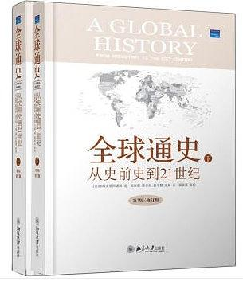
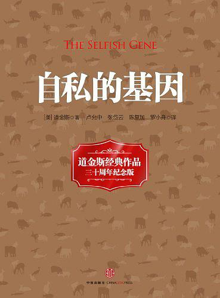
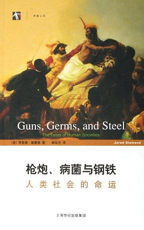
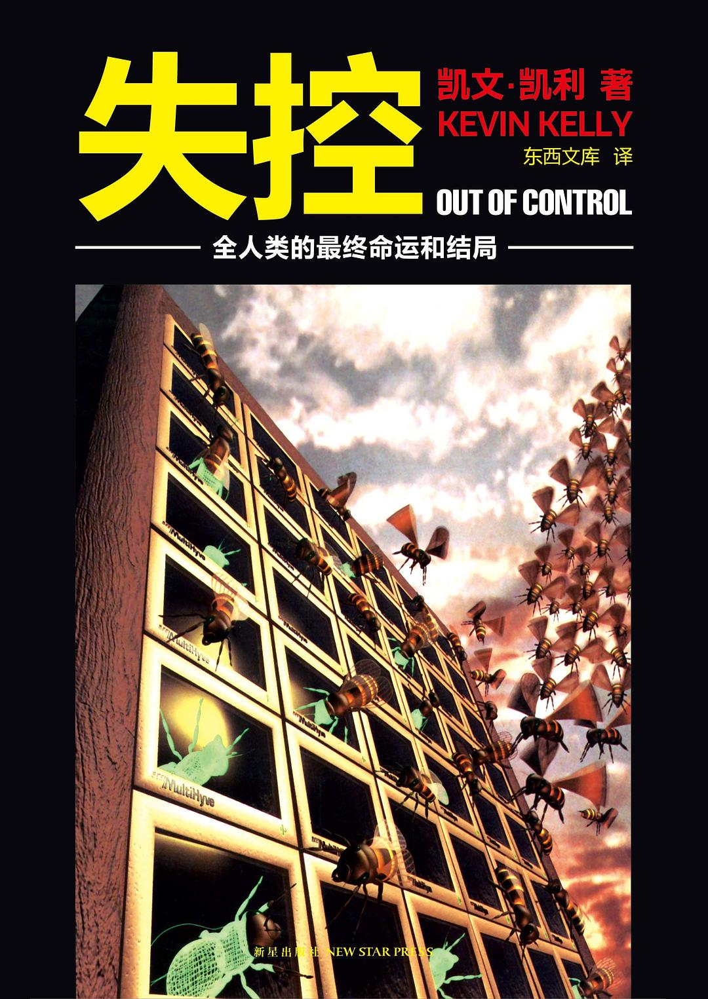
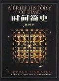
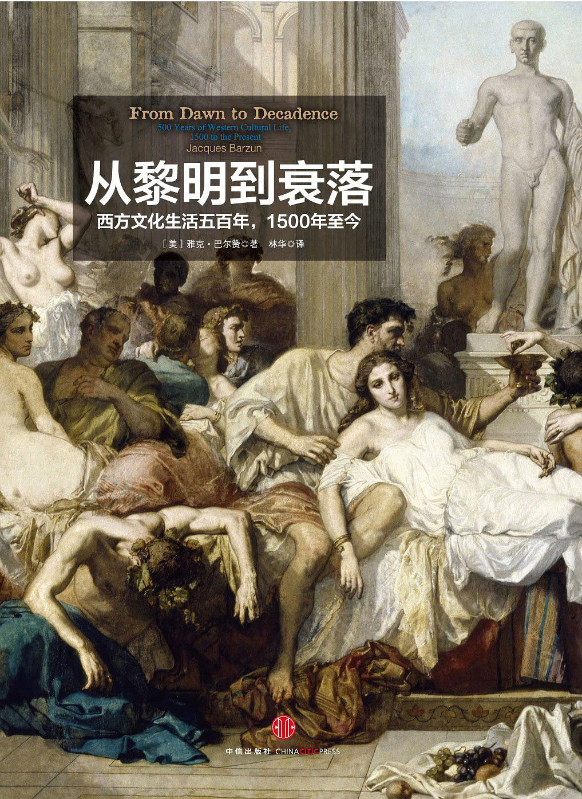
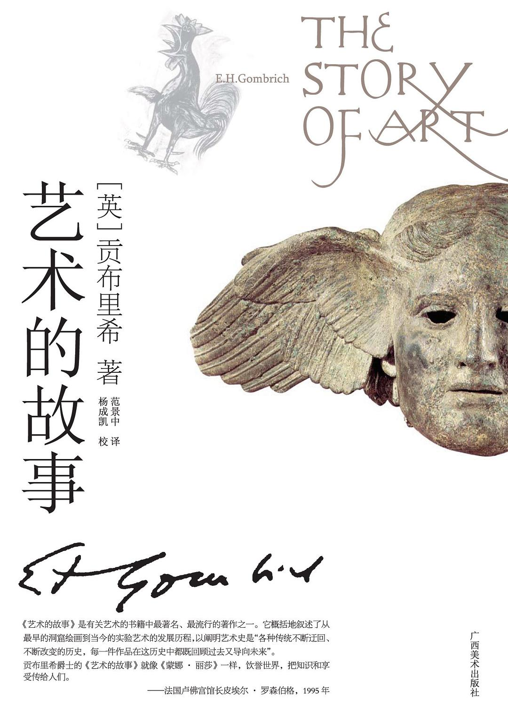

# 宋鸿兵推荐的七本书
近期在刷宋鸿兵先生的鸿观系列视频，真是有点相见恨晚啊！其中有几期给大家推荐了几本好书，今天总结了一下分享给大家。以下书的内容简介摘自豆瓣。

宋鸿兵介绍了自己对图书的判断标准：“好书”，“脑洞级别的好书”，和“颠覆三观的好书”。一本“好书”需要有观点、有自己的完备逻辑架构，血肉丰满，有大量的知识细节，读起来有节奏感。在此基础上，能提出突破性的，有冲击力的新颖观点、新颖逻辑架构的书，令人“脑洞大开”，就是“脑洞级别的好书”。而更高的层次是其观点和逻辑架构能够颠覆三观。

### 1.《全球通史》豆瓣评分：9.1

《全球通史》由斯塔夫里阿诺斯著，吴象婴、梁赤民、董书慧、王昶译，作者在本书中采用全新的史学观点和方法，将整个世界看作一个不可分割的有机的统一体，从全球的角度而不是从某一国家或某一地区的角度来考察世界各地区人类文明的产生和发展，把研究重点放在对人类历史进程有重大影响的诸历史运动、诸历史事件和它们之间的相互关联和相互影响上，努力反映局部与整体的对抗以及它们之间的相互作用。本书一经问世，受到著名历史学家汤因比和巴勒棵拉夫高度评价，立即被译成多种文字，流传甚广，影响很大。

《全球通史》上起人类的起源，下迄21世纪初多极世界相待时期，上下数十万年，一气呵成。除了政治、经济外，还涉及军事、文化、教育、宗教、科学技术、人口、移民、种族关系、道德风尚、思想意识等各个方面。读来颇觉新颖爽朗，有强烈的现实感。从文字内容来看，作者对庞杂的史料取舍恰当，对各种历史事件着笔简要，边叙边议，文字生动；从编写技巧来看，每章前冠以简明提要，承上启下，便于掌握线索，每章末附有选读书目，便于进一步研究。

豆瓣链接：https://book.douban.com/subject/10583099/

### 2.《自私的基因》豆瓣评分：8.5

《自私的基因》是20世纪最经典的著作，这版三十周年纪念版，在前版本基础上有两章增补和修订。我们从哪里来，又将到哪里去。生命有何意义，我们该如何认知自己？《自私的基因》充满想象力。任何生物，包括我们自己，都只是求生的机器。这本书是实实在在的认知科学，复制、变异和淘汰简单的三种机制可以演变出所有大千世界生命现象里的林林总总。

道金斯在《自私的基因》中的突破性贡献在于，把根据自然选择的社会学说的这一重要部分，用简明通俗的形式，妙趣横生的语言介绍给大家，这是第一次。他惊世骇俗地在《自私的基因》中提出：我们生来是自私的。人类窥见了社会关系中基本的对称性和逻辑性，在我们有了更充分的理解之后，我们的政治见解当会重新获得活力，并对心理学的科学研究提供理论上的支柱。在这一过程中，我们也必将对我们受苦受难的许多根源有一个更深刻的理解。

豆瓣链接：https://book.douban.com/subject/11445548/

### 3.《枪炮、病菌和钢铁》豆瓣评分：8.8

为什么是欧亚大陆人征服、赶走或大批杀死印第安人、澳大利亚人和非洲人，而不是相反？为什么么小麦和玉米、牛和猪以及现代世界的其他一些“不了起的”作物和牲畜出现在这些特定地区，而不是其他地区？在这部开创性的著作中，演化生物学家贾雷德.戴蒙德揭示了事实上有助于形成历史最广泛模式的环境因素，从而以震撼人心的力量摧毁了以种族主义为基础的人类史理论，因其突出价值和重要性，本书荣获1998年美国普利策奖和英国科普书奖，并为《纽约时报》畅销书排行榜作品。

本书是理解人类社会发展史方面的一个重大进展，它记录了现代世界及其诸多不平等所以形成的原因，也是一部真正关于全世界各民族的历史，是对人类生活的完整一贯的叙述，娓娓道来，具有很强的可读性。

豆瓣链接：https://book.douban.com/subject/1813841/

### 4.《失控》豆瓣评分：8.7

《失控》，全名为《失控：机器、社会与经济的新生物学》（Out of Control: The New Biology of Machines, Social Systems, and the Economic World）。

2006年，《长尾》作者克里斯·安德森在亚马逊网站上这样评价该书：

“这可能是90年代最重要的一本书”，并且是“少有的一年比一年卖得好的书”。“尽管书中的一些例子在十几年后可能有些过时，但（它们所表达的）信息却越来越成为真知灼见”。“在那时人们还无法想象博客和维基等大众智慧的突起，但凯利却分毫不差地预见到了。这可能是过去十年来最聪明的一本书。”

这是一部思考人类社会（或更一般意义上的复杂系统）进化的“大部头”著作，对于那些不惧于“头脑体操”的读者来说，必然会开卷有益。

《失控》成书于1994年，作者是《连线》杂志的创始主编凯文·凯利。这本书所记述的，是他对当时科技、社会和经济最前沿的一次漫游，以及借此所窥得的未来图景。

书中提到并且今天正在兴起或大热的概念包括：大众智慧、云计算、物联网、虚拟现实、敏捷开发、协作、双赢、共生、共同进化、网络社区、网络经济，等等。说它是一本“预言式”的书并不为过。其中必定还隐藏着我们尚未印证或窥破的对未来的“预言”。

豆瓣链接：https://book.douban.com/subject/5375620/

### 5.《时间简史》豆瓣评分：8.8

《时间简史》讲述是探索时间和空间核心秘密的故事，是关于宇宙本性的最前沿知识，包括我们的宇宙图像、空间和时间、膨胀的宇宙不确定性原理、基本粒子和自然的力、黑洞、黑洞不是这么黑、时间箭头等内容。第一版中的许多理论预言，后来在对微观或宏观宇宙世界观测中得到证实。

自1988年首版以来，《时间简史》已成为全球科学著作的里程碑。它被翻译成40种文字，销售了近1000万册。此版更新了内容，把许多观测揭示的新知识，以及霍金最新的研究纳入，并配以250幅照片和电脑制作的三维和四维空间图。

豆瓣链接：https://book.douban.com/subject/1034282/

### 6.《从黎明到衰落》豆瓣评分：8.9

《从黎明到衰落：西方文化生活五百年，1500年至今》：史学大师将500年的西方文化编织成一部优美流畅、气势恢宏的史诗巨制、20世纪最伟大的文化论著；两卷在手，纵览五百年西方文化的宏伟画卷！

民主政治、个人自由、女权运动、性解放、工业化社会、原子弹、数字时代……西方文明带来的美德与罪恶，几乎已经完全渗透全球每个人的生活，你可知道这一切从何开始？让史学大师雅克•巴尔赞带你回到过去，细说西方文明如何在五百年中渐渐开花结果，带来我们如今所见的世界；又如何盛极而衰，面临再生的瓶颈……

巴尔赞考察了从文艺复兴到20世纪末500年间西方文明的方方面面，包括政治制度、社会思潮、宗教、哲学、文学、音乐、美术、科技发明、民俗及社会生活等。他以四场“真正的革命”为标志来对这五百年进行划分：宗教革命、君主制革命、自由革命和社会革命，并以此为主轴，详述这些变革在思想与物质层面所带来的冲击，这些冲击又如何交互作用塑造出今日我们所见的世界。

在他流畅的文笔之下，五百年的历史故事也能像《红楼梦》一样，出场人物个个栩栩如生，“剧情”高潮迭起，无处不精彩！不论是名列史传却面目模糊的名士，或是名不见经传的小人物，巴尔赞都能还他们有血有肉的真面目；书中有爆炸性的大事件，也有乍看琐碎却寓意深远的琐事，经过大师提纲挈领，五百年来多不胜数的种种事件人物，逐渐融合成一幅属于西方文明的立体图像。

阅读这本书，注定是一段非比寻常的西方文化之旅。

豆瓣链接：https://book.douban.com/subject/25752592/

### 6.《艺术的故事》豆瓣评分：8.8

《艺术的故事》概括地叙述了从最早的洞窟绘画到当今的实验艺术的发展历程，以阐明艺术史是“各种传统不断迂回、不断改变的历史，每一件作品在这历史中都既回顾过去又导向未来。

继1997年三联版《艺术的故事》后，英国费顿出版社授权广西美术出版社独家出版，也是国内唯一合法授权的版本。

豆瓣链接：https://book.douban.com/subject/3162991/