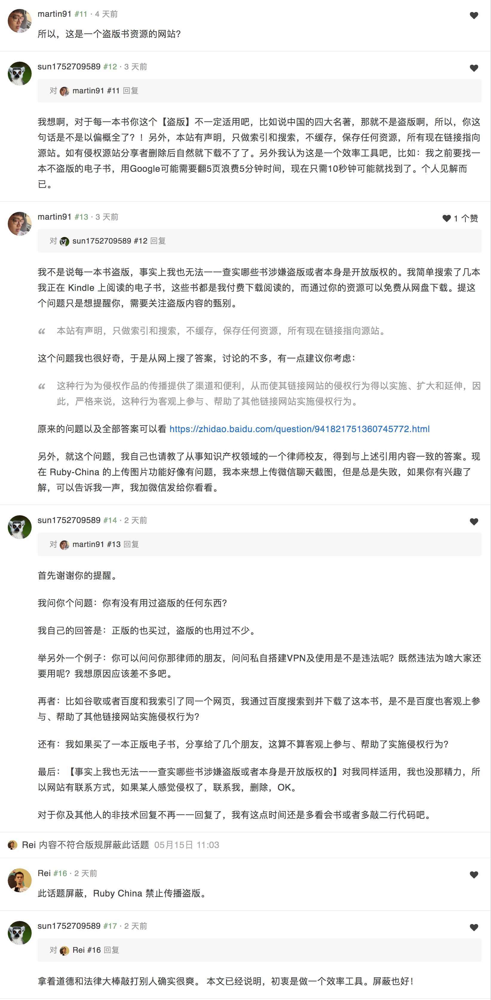
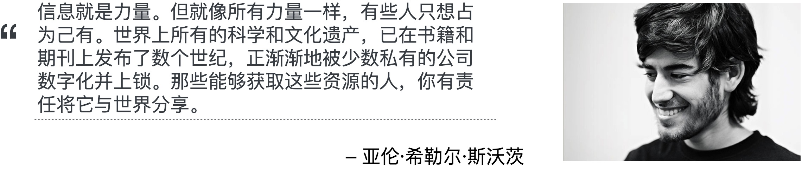

# 关于对版权的回应
最近做了个搜电子书的小网站，最根本的初衷是解决自己在谷歌找电子书的效率低下问题，往往找一本书需要浪费好几分钟的时间。网站其实没有什么技术含量，就是对几个优质电子书网站做了聚合搜索，这样我就不用一一去每个网站按关键字搜索一遍。不过，网上总有一些人想站在道德的制高点喷二下：`这种行为为侵权作品的传播提供了渠道和便利，从而使其链接网站的侵权行为得以实施、扩大和延伸，因此，严格来说，这种行为客观上参与、帮助了其他链接网站实施侵权行为。`

我只想说，你说的对！但是，为啥你没想到我同样为自由版权的经典之作的传播作出了自己的贡献呢？！而你除了在这里喷之外还干啥了？！这些资源全部来自网络，我只是减少了他们寻找到他的时间，有了这些时间，他们可以有更多的时间享受读书的乐趣。

我既不理直也不气壮，做自己的事，让别人喷去吧！

另外，网站已经声明了，对于版权，我也尊重，如有发现侵权，马上联系我，我会第一时间处理掉。因为这些资源都是爬虫爬取的，我也有工作要做，不可能一一鉴别。

## 对于版权的个人认识
我承认自己不是一个完全拥护版权的人，总比一些伪君子强，一边享受着盗版的便利，一边拿着道德和法律的大棒任意敲打别人。如果你能做到这辈子完全没用过盗版，再来喷我，到时候肯定让你收下我的膝盖！个人很崇尚一句话：书写出来并不是为了藏在高墙之后，而是为了向世界传播，激励和启发世人。知识不是一小部分人的特权，是应该自由顺畅流向每一个需要它的人。

## 亚伦·希勒尔·斯沃茨

## 如若涉及到惩罚
本人已经明白且知道，可能会涉及到版权并且受到应有的处罚。本站并不涉及到商业，所以受到的处罚即使有应该也很小！大不了去监狱里待几年，还省的买房了，房价这么高。

很崇尚一句话：佛曰，我不如地狱，谁入地狱。只要这个网站能给你省时间并让你找到几本好书，并且因此可能影响到一些人，那做这个网站就完全值了！