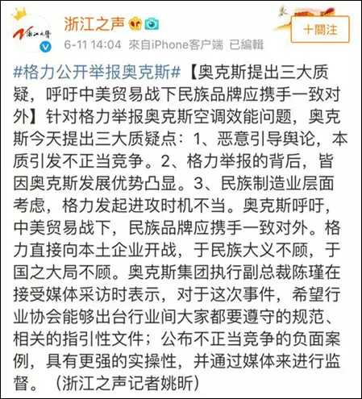

# 格力和奥克斯之猫狗大战
近几天啊，格力举报奥克斯造假在网上传的沸沸扬扬，咱们先稍微回顾一下细节，然后站在消费者的角度点评点评。

事情是这样的：
6月10日，格力电器发布《关于奥克斯空调股份有限公司生产销售不合格空调产品的举报信》，指出奥克斯空调价格便宜但耗电量很大，产品与其宣传、标称的能效值差距较大，能效比和制冷消耗功率的检测结论均为不合格。奥克斯随后回应称，对于格力的不实举报，已向公安机关报案，并将向司法机关提起诉讼，依法保护公司合法权益，维护市场正常秩序。由此，二家开始了撕逼大战。据说，这次是董明珠小姐亲自出马实名举报。

冰冻三尺，非一日之寒。其实二家的积怨由来已久。在格力发布举报信的当天，微信公号“董明珠自媒体”发布《董明珠：中国造的崛起，不是要霸道，是要做一个强者》里面就指出奥克斯之前采用商业不正当手段从格力挖人：“某同行天天来我这挖人，拿到了这款空调的技术，他知道我们这个技术比较保密 ，没有申请专利，就用它来申请专利然后起诉我们，而格力在他申请专利的前几年就有了这款产品，最终这个案子宣布他败诉。 他们把我们的很多专利做成自己的产品，那这就要和他较量，绝对不能允许这种行为，因为这破坏了创新企业的积极性。”

面对格力咄咄逼人的态势，奥克斯坐不住了，这不，发官微来回应了：

下面咱们站在消费者角度看看这三条回应：
1. 说到不正当竞争，奥克斯之前好像没少用，挖人墙角，现在想站在道德高点敲打别人，呵呵。。。对咱消费者来说，如果他们没有竞争，那才可怕，想想之前的假疫苗和毒奶粉。至于是不是恶意竞争，我相信大家的眼睛是雪亮的。
2. 奥克斯发展优势凸显？？？这个我一直觉得格力的空调确实不错，至于奥克斯，怪我孤陋寡闻喽，暂时没听说他有啥优势。
3. 开始打民族感情牌了，我估计这才是奥克斯的真正目的，你格力即使咬也别现在咬啊！说实话，这招是挺阴的，这明显不是给政府看的吗，赶紧出来调停。说实话，你奥克斯能扛起民族品牌的大任吗？！什么是民族大义呢？合起伙来坑蒙拐骗自己老百姓？呸！

说到底呢，咱消费者永远都是弱势群体，有时候真的是被无量企业坑的没办法了，投诉无门，只能爬到汽车引擎盖上哭诉。但凡企业、卖家稍微有点良知，广大群众都看着呢，谁好谁坏靠的是口碑而不是金杯银杯！

最后，和大家一起坐等有关部门的调查吧。造假者应该受到应有的惩罚！