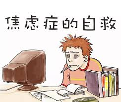

## 如何摆脱越努力反而越焦虑的困境?
尼采曾说过：“所有杀不死我的，都会让我变得更强大”。所以，尽管焦虑让我们身心饱受摧残和折磨，但我们要清楚一点，焦虑情绪终归不是敌人，而是益友。

那我们该如何更好的缓解焦虑呢？

以下四步，是焦虑平衡理论创始人卡尔·弗农总结的缓解焦虑的步骤。曾经的他，也是一名重度焦虑患者。但如今，他不仅料理好了自己，还帮助了50多个国家和地区的人们摆平焦虑。让我们一起来看一下吧。

### 1.停止你无休止的想象。
说实话，我们的想象力真的是一个很神奇的东西，能帮我们开展漫无边际的想象。焦虑情绪之所以能肆无忌惮，是我们的想象力给它们注入了能量。

比如，我现在依稀记得，自己在初中音乐课考试上的糟糕表现，当着全班人唱歌后，同学们的窃窃私语和暗地嘲笑。为此，我真的是烦躁了好长一段时间。每天都在想象着，同学们在被背后是如何议论和嘲笑自己。有时甚至不敢在校园内大声说话，担心被人认出来。还是事后的一次聚会我才知道，其实人们早就淡忘了当时的情景，甚至不记得我唱的什么。

其实我们在意的也是他人对自己的看法，那如果他人已经忘记自己的当时的表现或者没有看法，我们自己又何必不停纠结呢？所以，如果想减轻焦虑情绪，首先要做的就是告诉自己：“好了，事情也许并没有那么糟糕，我还是能想出解决办法的，或者是我还是能承受住的。”或者告诉自己：“每个人都会有类似尴尬、窘迫的时候，何必看的太重呢？”

### 2.让头脑中的焦虑变得可控。
控制焦虑是什么？真的有效吗？

心理学家曾做过这样一个有趣的实验，他要求受试者在一定时间内执行一项需要专注才能完成的任务比如智力测验，并且在实验过程中时不时会响起令人心情不悦的噪声。不出所料的是，几乎所有受试者在噪声的影响下表情和动作变得焦虑、烦躁，手心不停的出汗，很难集中精神。然后，他为一部分受试者提供了“可控按钮”，只要按下按钮，能够随即停止噪声。渐渐地，这部分受试者的脸上的表情变得缓和、内心开始恢复平静，尽管很少有人真的按下了按钮。

同样的道理，懂得掌控焦虑，我们紧张、焦躁的内心世界才能发生改变。

关于掌控焦虑，我常用的方法是理性分析法，因为让你焦虑的事，本身就是一堆复杂的事情。第一步，清楚焦虑的原因是什么，分析出别人的哪些看法，开始产生不适感；第二步，问问自己为什么这些看法会让自己产生不适感；第三步，我的哪些行为能减轻这些不适感；第四步，落实到行动上，最好从自己擅长的方面入手。

### 3.别总待在角落里，换个环境试试。

最近湖南卫视有一档比较火的节目《向往的生活》，讲的就是美好的田园生活，能让人的内心变得宁静。

记得有一期黄渤、黄磊、何炅和王迅几个人，坐在自家的校园里，天空下着蒙蒙细雨，几个人讲述着自己年轻时的种种美好，唱着自己那个年代的流行歌曲，真的让人忘记了城市的喧嚣、工作的压力，好好地享受生活。

虽然只有短短的一两天，但是很多嘉宾都表示，事还是那些事，换个环境，自己整个人都变得轻松了，这才是自己向往的生活。同样的，我们也需要改变一下我们所处的环境，比如去周围的书店或咖啡馆，安静的听着轻音乐，或者是泡一个大澡，享受全身放松带来的舒适感。

### 4.运动健身，释放你的情绪。
焦虑，说白了也是一种情绪。就像我们的喜怒哀乐一样，需要释放出来。而运动，恰恰是一种不错的选择，适当的运动，能帮助你转移注意力，摆脱负面情绪，因为运动能产生令人愉悦的物质，而使人感到快乐。所以，多去享受一下那种大汗淋漓带来的畅快与舒适感吧，你需要这种简单且有效的方式，将自己内心情绪彻底释放出来。

总之，焦虑是一种正常的情绪表达，我们要学的是如何去平衡焦虑，让自己恢复到一种正常水平即可，切不可过分关注，也不能假装忽略。