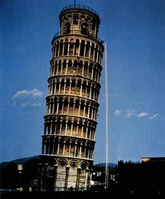
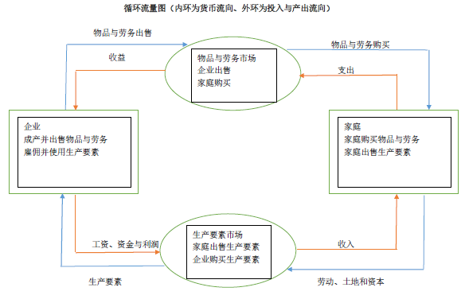
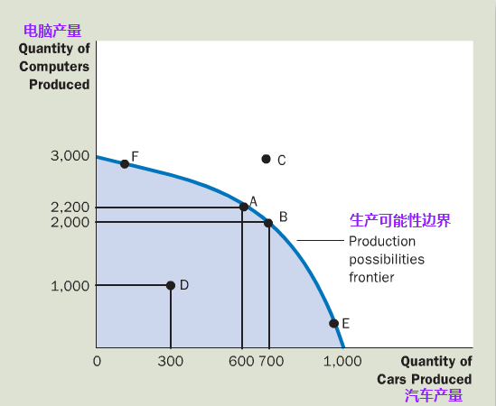
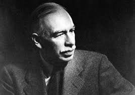
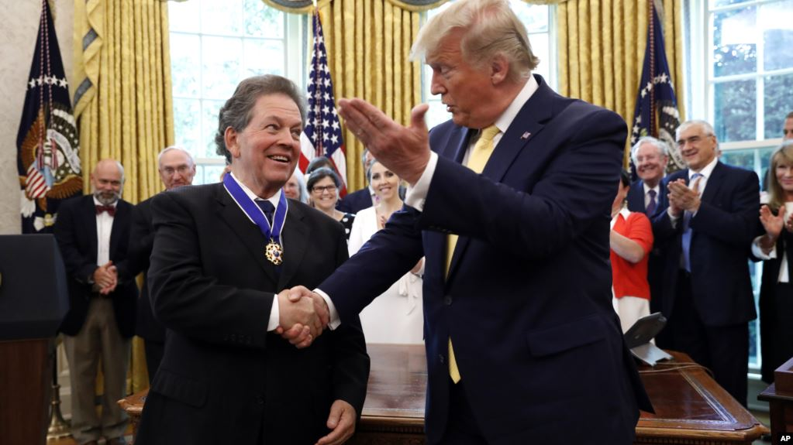

# 如何像经济学家一样思考
每个研究领域都有自己的语言和思考方式，当我们谈论数学或者物理学时会有各种奇奇怪怪的符号，当我们谈论刑侦学时会有案发现场、作案动机等名词，当我们谈论医学时会有各种可怕的疾病和各种昂贵的检查化验和药物。

经济学家也一样，供给、需求、弹性、消费者等这些术语是经济学家语言的一部分。这些词语其实并不神秘，只要你了解了它背后所代表的含义。他的价值就是提供一种关于你所生活的世界的新的、有用的思考方式。

## 作为科学家的经济学家
似乎听起来有点不可思议，毕竟经济学家们不是拿着试管或者望远镜进行研究，但是经济学家努力以科学家的客观性来探讨他们所研究的主题，和其他学科一样：首先提出理论，再收集数据，分析数据，最后证明或否定理论。正如爱因斯坦所说：所有科学不过是日常思考的不断完善而已。科学方法就是---建立并检验世界如何运行的各种理论。

### 科学方法：观察、理论和进一步观察
我又要拿牛顿被苹果砸了一下后总结出万有引力举例了，本来苹果落地再平常不过，但是牛顿却总结出来了万有引力理论，这个理论不仅解释了苹果为什么会掉到地上，而且适用于宇宙中任意二个物体之间(量子理论里面除外)，是经过时间和实验验证过的。

理论和观察之间的这种相互作用同样发生在经济学领域中，比如我是一个生活在民国内战时期的经济学家，我通过观察提出一种通货膨胀理论：当政府发行了过多的货币时，高通货膨胀就会发生。为了检验我的理论，我收集了历史上其他国家里物价水平和货币量的数据，经过分析，如果货币增长和价格上升速度无关，那我就会怀疑自己的理论是否正确，如果这二者之间有密切关系，我就会更加相信自己提出的通胀理论。

另外，经济学家并不能像其他学科中那样可以做一些实验验证自己的理论，经济学家不会被允许操作一国货币发行量来验证自己的通胀理论，所以为了寻找实验替代品，经济学家十分关注历史所提供的自然实验数据。

### 假设的作用
简单来说：假设可以使复杂的世界简单化，从而使解释这个世界变得更容易。

比如我们从百米高楼抛下一个物体到落地需要多上时间，我们可能会假设忽略空气阻力，但是真实世界并不是没有空气阻力的，但是这个阻力如此之小，小到我们有些时候可以忽略它，这样会使这个问题变得更简单，然而答案对结果没有实质影响。

经济学里面也一样，假设很有用！比如我们在研究国际贸易时，我们会假设世界上只有二个国家，而每个国家只生产二种产品。然而现实中，世界是有许许多多的国家组成的，而每个国家都生产成千上万中商品。但是如果我们理解了简化后的国际贸易，我们就可以更好的理解现实世界中更复杂的国际贸易。

### 经济模型
经济学家也用模型来了解世界，和生物钟解剖学用的塑料模型不同，经济学家通常用图形和方程组成模型。正如上个概念所讲的，经济模型中也是用假设建立起来的，我们不可能建立一个和现实世界完全一样的模型，那样的话这个模型一定是复杂到无法使用的。

下面我们来简单介绍二个经济学的模型，今天只是简单介绍，后面会有文章更加详细的分析这些模型。

#### 循环流量图

一个说明货币如何通过市场在家庭与企业之间流动的直观经济模型。该模型中，经济由两类决策者组成，即家庭和企业。企业用劳动、土地和资本(建筑物和机器)这些投入品来生产物品与劳务，这些投入品称为生产要素。家庭则拥有生产要素并消费企业生产的物品与劳务。家庭和企业在物品与劳务市场(家庭是买者，企业是卖者)，和生产要素市场(企业是买者，家庭是卖者)上相互交易。

#### 生产可能性边界

该模型表示在一定的技术条件下，一国的全部资源所能生产的各种物品或者劳务的最大产量。所以这个模型研究怎么使用稀缺的资源去最有效率的生产。

### 微观经济学与宏观经济学
经济学被分为二大领域，微观经济学研究家庭和企业之间如何做出决策，以及如何在特定市场上相互交易。宏观经济学研究整体经济现象。

宏观经济学和微观经济学是密不可分的。由于整体经济的变动产生由千百万个人和企业决策，所以不考虑微观经济学决策而去理解宏观经济学是不可能的。但是二者之间又有不同，二个领域都有自己一套固有的模型。

## 作为政策顾问的经济学家
当经济学家试图去解释世界时，他们是科学家。当经济学家试图帮助改善世界时，他们是政策顾问。

### 实证分析与规范分析
先说概念：

1. 实证表述：试图描述世界是什么样子的。
2. 规范表述：试图描述世界应该是什么样子的。

二者之间从根本上来说是不同的，他们的区别是我们如何判断它们的正确性。

可以举一个例子帮助理解这二个概念：

1. 张三说：最低工资引起了失业。
2. 李四说：政府应该提高最低工资。

张三和李四想要做的事情是不同的。张三更像一个科学家，因为他做出了一种关于世界如何运行的表述(实证表述)。而李四更像一个政策顾问，因为他做出了如何改变世界的表述(规范表述)。

### 华盛顿的经济学家们
相信大家都听说过美国有各种智库，其中有许多就是专门研究经济学的。美国历史上有许多总统特别重视经济学家的建议，比如杜鲁门及他的杜鲁门主义。经济学家们的建议涉及到一国经济的方方面面，比如国家预算怎么做，国家税收政策怎么制定等等。当然对二战后世界影响最大的当属【凯恩斯主义】

### 为什么经济学家的建议并不总是被采纳
其实很简单，就是制定经济政策的过程在许多方面与经济学教科书上假设的理想化决策过程完全不同。经济学家提出各种提议后，总统先生听取后会做各种权衡取舍后决定要不要采纳以及下一步如何实施。

另外，有一句比较有名的嘲笑经济学家们的话：如果让所有经济学家围坐在一起，他们不会达成任何一个共识。下一篇文章我会给大家讲解经济学家意见分歧的原因，敬请期待。