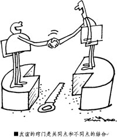

## 经济学家意见分歧的原因
【如果让所有经济学家围坐在一起，他们不会达成任何一个共识。】这是萧伯纳对经济学家的一句嘲讽。经济学家这个集团经常因为向决策者提供的建议相互矛盾而受到批评。那么为什么会这样呢？下面分析一下原因。


### 科学判断的不同
历史上，有地心说还是日心说这二种观点，人们对此争论不休。科学家为了认识我们生活的世界，需要持续不断的研究和观察，然而随着研究的深入，科学家对真理的认识会有分歧，这再正常不过了。

同样，经济学里也一样，由于对不同理论的正确性或对衡量经济变量如何相关的重要参数的大小有不同的直觉，经济学家们也会产生意见分歧。

下面举个例子：

现在大部分国家是对个人所得收个人所得税，但是有经济学家提出应该对人们收【消费税】，就是说当你消费时需要交税，消费越多交的税就越多，这样就会鼓励人们把钱更多的用于储蓄，高储蓄会使更多的资源用于资本积累，这样又会引起生产率的增长。而支持现行税法的经济学家认为鼓励储蓄的同时会抑制消费，那么企业生产的产品和服务该卖给谁呢？正是由于科学判断的不同引发了二种截然相反的观点。


### 价值观的不同
假如我一个月挣10万，征税1万，那么我的税率就是10%。我一个朋友收入2万，征税4000，那么他的税率就是20%。这个政策公平吗？我可能认为我交的税多了，然而朋友认为他的税率太高了。


由于价值观的不同，人们从不同的角度得出了相反的结论。然而我们不能只从科学的角度来判断政府政策，社会是一个大熔炉，政策不可能照顾所有人的利益，但要符合大多数人的利益。

### 感受与现实
由于科学判断的差别和价值观的不同，经济学家之间存在一些意见分歧是不可避免的，但不应该夸大这种分歧。在许多情况下，经济学家们的意见还是一致的，而且共识程度远远超出了人们有时认为的那样。

下面列出了大多数经济学家赞同的主张(数据来自《经济学原理》)：
```python
1.租金上限降低了可得到的住房的数量和质量。（93%）

2.关税和进口配额通常降低了总体经济福利。（93%）

3.弹性汇率和浮动汇率提供了一种有效的国际货币协定。（90%）

4.财政政策（例如，减税和/或增加政府支出）对低于充分就业的经济有重要的刺激效应。（90%）

5.美国不应该限制雇主将工作外包给其他国家。（90%）

6.美国应该取消农业补贴。（85%）

7.地方政府和州政府应该取消对职业运动队的补贴。（85%）

8.如果联邦预算要实现平衡，也应该是以经济周期为基础，而不是以年度为基础。（85%）

9.如果现行的政策保持不变，在接下来的50年中社会保障基金与支出之间的制品会持续扩大并超出承受能力。

10.现金支付给领取者增加的福利远远大于相当于现金价值的实物转移支付。（84%）

11.庞大的联邦预算赤字对经济有不利的影响。（83%）

12.最低工资增加了年轻人和不熟练工人的失业。（79%）

13.政府应该按“负所得税”的思路重建福利制度。（79%）

14.排污税和可交易的污染许可证作为控制污染的方法优于实行污染上限。（78%）
```

人们总倾向于强调自己与他人之间的不同，经济学家也不例外。所以他们的意见存在分歧是正常且有趣的。但共识更重要。学习经济学，像经济学家一样思考——着眼点应该更多集中在意见一致的领域，而不是存在分歧的领域——求大同，存小异。

