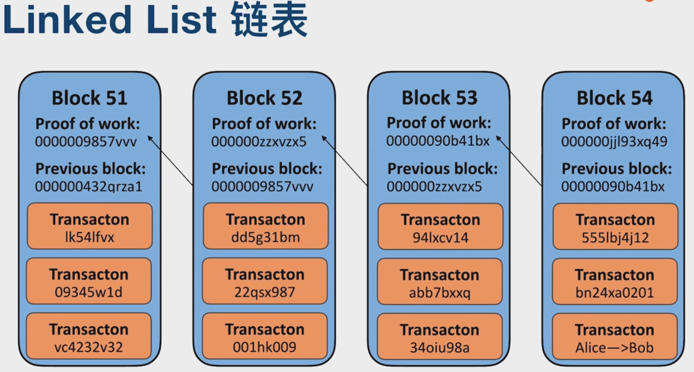
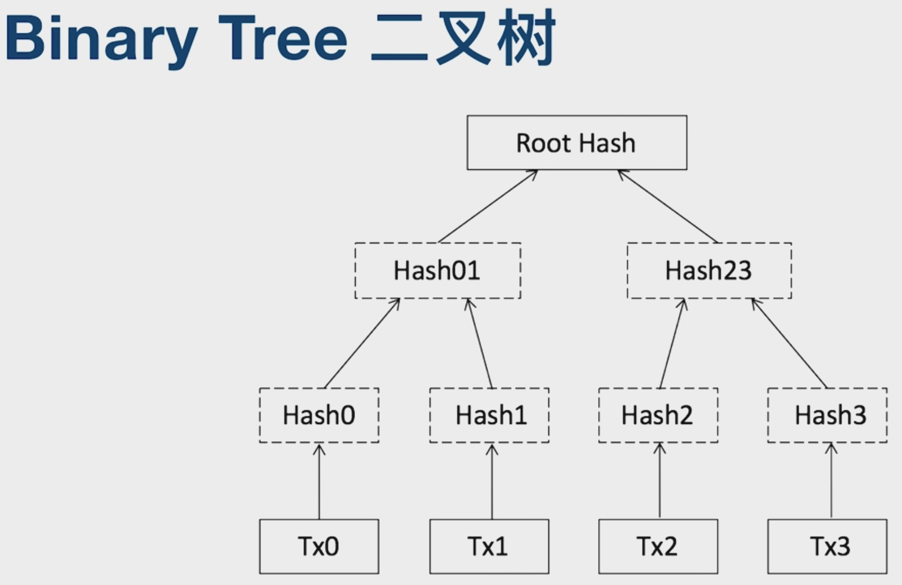
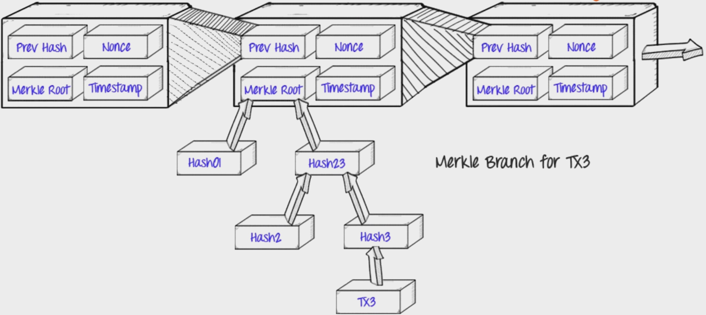

# 区块链的底层数据结构
区块链是分布式数据存储、点对点传输、共识机制、加密算法等计算机技术的新型应用模式。区块链（Blockchain），是比特币的一个重要概念，它本质上是一个去中心化的数据库，同时作为比特币的底层技术，是一串使用密码学方法相关联产生的数据块，每一个数据块中包含了一批次比特币网络交易的信息，用于验证其信息的有效性（防伪）和生成下一个区块。

## 块与块之间为Linked List
每一个块通过一个指针指向前继节点。

## 每一个块之内
只需验证根节点的hash值就能判定这个块有没有被篡改。

## 全局
