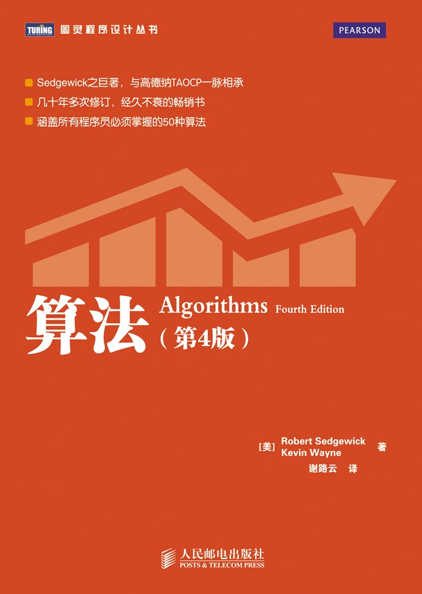

## 算法时间复杂度总结
今天来简单聊聊算法复杂度这个概念，算法复杂度包含时间复杂度和空间复杂度二个方面。

时间复杂度：评估执行程序所需的时间。可以估算出程序对处理器的使用程度。
空间复杂度：评估执行程序所需的存储空间。可以估算出程序对计算机内存的使用程度。

因为时间复杂度要比空间复杂度更容易产生问题也更有优化的价值，一般说来，不特别说明，复杂度就是指时间复杂度。

### 时间复杂度及其标示法
一般说来，一个算法要执行所耗费的时间，你不去机器上运行一下，是不可知的，即使你去机器上运行，每次执行所耗费的时间也应该是不一样的。但是我们怎么知道那个算法耗费的时间多那个耗费的时间少呢？这个就要看你设计的算法运行一次所执行的关键语句次数的多少了，如果你的算法执行的关键语句次数多，那么算法花费的整体时间就多，相反时间就少。我们把关键语句执行次数【也叫问题规模】记做n，则算法总运行时间可以记做T(n)。计算机中我们经常用O(n)来标示时间的复杂度，其中n为问题规模。

### 几种常见的时间复杂度及示例
需要说明的是，根据输入数据的不同，一般会有最好时间复杂度，最坏时间复杂度和平均时间复杂度。我们设计算法时不能指望输入数据每次都是最优的，因此，考虑到输入数据的随机性，我们一般care平均时间复杂度。当然，在生产环境遇到实际问题时，你要实际分析你的数据，设计最符合你当前数据的算法。

1. 常数时间复杂度O(1)
```python
str = 'hello world!'
print(str)
```

2. 对数时间复杂度O(log(n))
```python
# 最典型的例子就是二分查找。
for (i=0; i<n; i=i*2) {
  print(i)
}
```

3. 线性时间复杂度O(n)
```python
# 二叉树的遍历也是线性时间复杂度，因为每个节点只处理一次。
for (i=0; i<n; i++) {
  print(i)
}
```

4. 线性对数阶时间复杂度O(nlog(n))
```python
# 快速排序的复杂度就是线性对数阶时间复杂度
for (i=0; i<n; i++) {
  for (j=0; i<i; i=i*2) {
    print(i)
  }
}
```

5. 平方时间复杂度O(n^2)
```python
# 说白了就是二层循环
for (i=0; i<n; i++) {
  for (j=0; i<n; j++) {
    print(i, j)
  }
}
```

5. 立方时间复杂度O(n^3)
```python
# 说白了就是三层循环
for (i=0; i<n; i++) {
  for (j=0; i<n; j++) {
    for (k=0; k<n; k++) {
      print(i, j, k)
    }
  }
}
```

6. 指数时间复杂度O(2^n)
```python
# 斐波那契数列了解下。
for (i=0; i<math.pow(2,n); i++) {
  print(i)
}
```

7. 阶乘时间复杂度O(n!)
```python
# n! = 1 × 2 × ··· × n (n≥1)
for (i=0; i<factorial(n); i++) {
  print(i)
}
```

### 算法时间复杂度示意图
各算法时间复杂度排序：

O(1)<O(logn)<O(n)<O(nlogn)<O(n²)<O(n³)<O(2ⁿ)<O(n!)

大家感受下各时间复杂度差距：


### 书籍推荐《算法》
豆瓣评分9.3，这本书另一个名字就叫【算法圣经】是和《算法导论》齐名的一本书。

