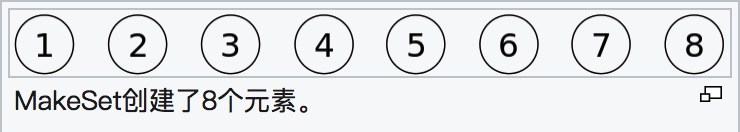
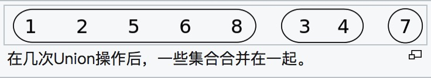
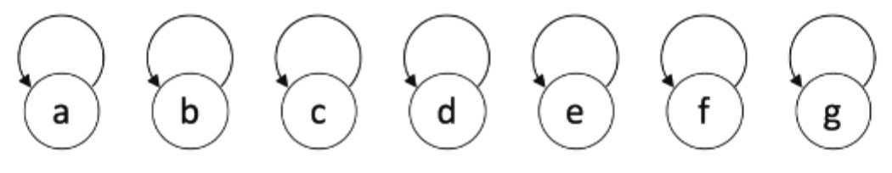
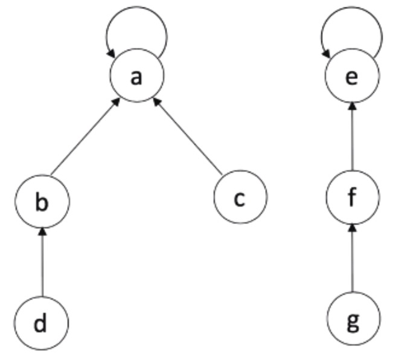
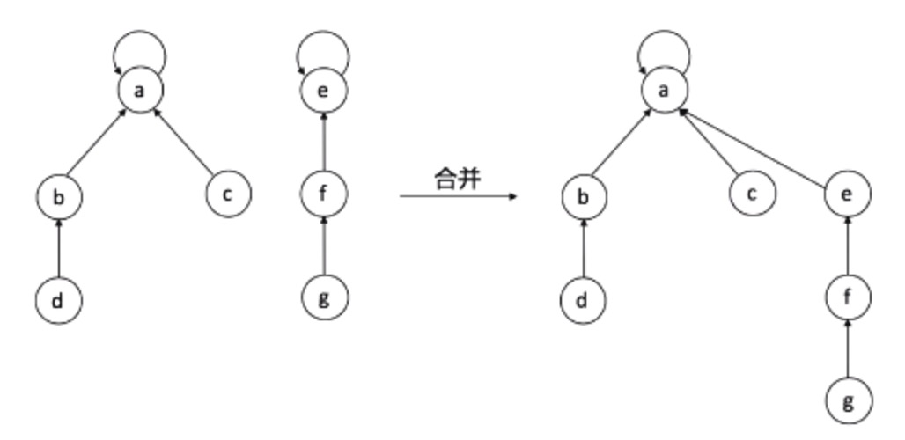
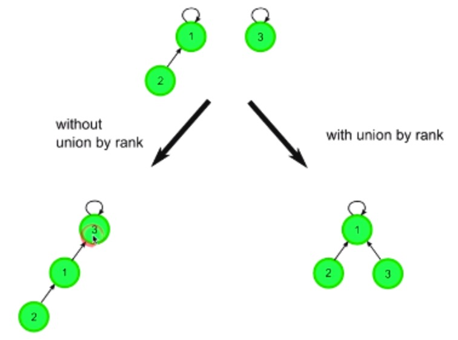
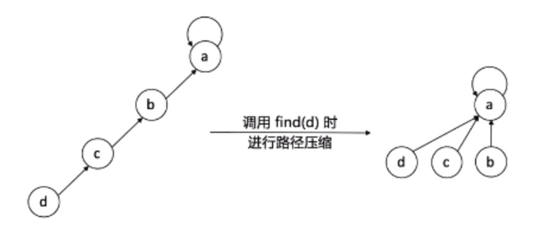

## 并查集入门指南
最近学到一个新的数据结构和算法叫并查集，顾名思义就是有【合并集合】和【查找集合中的元素】两种操作的关于数据结构的一种算法。简单来说，你可以这么理解：如果你看过香港拍的古惑仔电影，当二个古惑仔碰见打招呼时会相互问：你老大(你可以理解为黑帮头头)是谁？如果二人老大是同一人，那就无话不说了；如果不是一个老大，那说话之前就要考虑考虑了。

## 维基百科定义
>在计算机科学中，并查集是一种树型的数据结构，用于处理一些不交集（Disjoint Sets）的合并及查询问题。有一个联合-查找算法（union-find algorithm）定义了两个用于此数据结构的操作：<br><br>1. Find：确定元素属于哪一个子集。它可以被用来确定两个元素是否属于同一子集。<br><br>2. Union：将两个子集合并成同一个集合。





## 图形标示
我们首先定义节点：

```python
class Node:
    def __init__(self, x):
        self.val = x
        self.parent = self
```
初始状态，各自的parent为自己：



经过n次合并后，现在有二个集合：



并查集其实就是用集合中的某个元素来代表这个集合，该元素称为集合的【代表元】。现在a元素代表集合A，e元素代表集合E。

现在如果我们要查找d元素，则查找结果为d元素的最终老大为a元素，则我们就说d元素属于集合A。同理元素f属于集合E。

现在我们将A集合和E集合合并：



现在元素a代表整个新集合A‘

## 并查集二种优化办法

### 1. 执行union操作时，尽量选择使整棵树高度最小的方案合并。



这样合并的话，在执行find操作时会降低查找执行次数。

### 2. 路径压缩



即将所有元素的父亲节点全指向根节点。目的同1，都是为了加快查找速度。

## 相关LeetCode习题
有兴趣的同学可以去刷刷这二道题目：

[LeetCode 200：岛屿数量](https://leetcode-cn.com/problems/number-of-islands/)

[LeetCode 547：朋友圈](https://leetcode-cn.com/problems/friend-circles/)