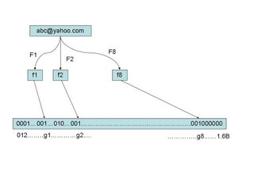

### 布隆过滤器
>转自吴军《数学之美》

在日常生活中，包括在设计计算机软件时，我们经常要判断一个元素是否在一个集合中。比如在字处理软件中，需要检查一个英语单词是否拼写正确（也就是要判断它是否在已知的字典中）；在 FBI，一个嫌疑人的名字是否已经在嫌疑名单上；在网络爬虫里，一个网址是否被访问过等等。最直接的方法就是将集合中全部的元素存在计算机中，遇到一个新元素时，将它和集合中的元素直接比较即可。一般来讲，计算机中的集合是用哈希表（hash table）来存储的。它的好处是快速准确，缺点是费存储空间。当集合比较小时，这个问题不显著，但是当集合巨大时，哈希表存储效率低的问题就显现出来了。比如说，一个象 Yahoo,Hotmail 和 Gmai 那样的公众电子邮件（email）提供商，总是需要过滤来自发送垃圾邮件的人（spamer）的垃圾邮件。一个办法就是记录下那些发垃圾邮件的 email 地址。由于那些发送者不停地在注册新的地址，全世界少说也有几十亿个发垃圾邮件的地址，将他们都存起来则需要大量的网络服务器。如果用哈希表，每存储一亿个 email 地址， 就需要 1.6GB 的内存（用哈希表实现的具体办法是将每一个 email 地址对应成一个八字节的信息指纹 ，然后将这些信息指纹存入哈希表，由于哈希表的存储效率一般只有 50%，因此一个 email 地址需要占用十六个字节。一亿个地址大约要 1.6GB， 即十六亿字节的内存）。因此存贮几十亿个邮件地址可能需要上百 GB 的内存。除非是超级计算机，一般服务器是无法存储的。

今天，我们介绍一种称作布隆过滤器的数学工具，它只需要哈希表 1/8 到 1/4 的大小就能解决同样的问题。
布隆过滤器是由巴顿.布隆于一九七零年提出的。它实际上是一个很长的二进制向量和一系列随机映射函数。我们通过上面的例子来说明起工作原理。

假定我们存储一亿个电子邮件地址，我们先建立一个十六亿二进制（比特），即两亿字节的向量，然后将这十六亿个二进制全部设置为零。对于每一个电子邮件地址 X，我们用八个不同的随机数产生器（F1,F2, ...,F8） 产生八个信息指纹（f1, f2, ..., f8）。再用一个随机数产生器 G 把这八个信息指纹映射到 1 到十六亿中的八个自然数 g1, g2, ...,g8。现在我们把这八个位置的二进制全部设置为一。当我们对这一亿个 email 地址都进行这样的处理后。一个针对这些 email 地址的布隆过滤器就建成了。（见下图）



现在，让我们看看如何用布隆过滤器来检测一个可疑的电子邮件地址 Y 是否在黑名单中。我们用相同的八个随机数产生器（F1, F2, ..., F8）对这个地址产生八个信息指纹 s1,s2,...,s8，然后将这八个指纹对应到布隆过滤器的八个二进制位，分别是 t1,t2,...,t8。如果 Y 在黑名单中，显然，t1,t2,..,t8 对应的八个二进制一定是一。这样在遇到任何在黑名单中的电子邮件地址，我们都能准确地发现。

布隆过滤器决不会漏掉任何一个在黑名单中的可疑地址。但是，它有一条不足之处。也就是它有极小的可能将一个不在黑名单中的电子邮件地址判定为在黑名单中，因为有可能某个好的邮件地址正巧对应个八个都被设置成一的二进制位。好在这种可能性很小。我们把它称为误识概率。在上面的例子中，误识概率在万分之一以下。
布隆过滤器的好处在于快速，省空间。但是有一定的误识别率。常见的补救办法是在建立一个小的白名单，存储那些可能别误判的邮件地址。

### 布隆过滤器的误识别问题
布隆过滤器有一个很重要的特性就是：如果判断一个元素不在集合中，那么100%正确；若果判断一个元素在集合中，那么有一定概率不正确。

这个误判在检验上称为假阳性，这个概率很小(万分之几以下)，具体的误判概率根据你具体实现算法是可以推出来的，具体请参考吴军《数学之美》中的布隆过滤器章节。由于布隆过滤器只涉及简单的算术运算，所以它的判定速度很快。

### 书籍推荐《数学之美（第二版）》
几年前，“数学之美”系列文章原刊载于谷歌黑板报，获得上百万次点击，得到读者高度评价。读者说，读了“数学之美”，才发现大学时学的数学知识，比如马尔可夫链、矩阵计算，甚至余弦函数原来都如此亲切，并且栩栩如生，才发现自然语言和信息处理这么有趣。

今年，作者吴军博士几乎把所有文章都重写了一遍，为的是把高深的数学原理讲得更加通俗易懂，让非专业读者也能领略数学的魅力。读者通过具体的例子学到的是思考问题的方式 —— 如何化繁为简，如何用数学去解决工程问题，如何跳出固有思维不断去思考创新。


### 布隆过滤器的python语言实现
使用python中的包【pip install pybloom】如果是python3请安装【pip install dm-pybloom】

```python
>>> from pybloom import BloomFilter

>>> f = BloomFilter(capacity=1000, error_rate=0.001) # (容量,误差)
>>> [f.add(x) for x in range(10)]
[False, False, False, False, False, False, False, False, False, False]
>>> all([(x in f) for x in range(10)])
True
>>> 10 in f
False
>>> 5 in f
True

>>> f = BloomFilter(capacity=1000, error_rate=0.001)
>>> for i in xrange(0, f.capacity):
... _ = f.add(i)
>>> (1.0 - (len(f) / float(f.capacity))) <= f.error_rate + 2e-18
True

# 容量自增的布隆过滤器实现
>>> from pybloom import ScalableBloomFilter

>>> sbf = ScalableBloomFilter(mode=ScalableBloomFilter.SMALL_SET_GROWTH)
>>> count = 10000
>>> for i in xrange(0, count):
... _ = sbf.add(i)
...
>>> (1.0 - (len(sbf) / float(count))) <= sbf.error_rate + 2e-18
True
```
