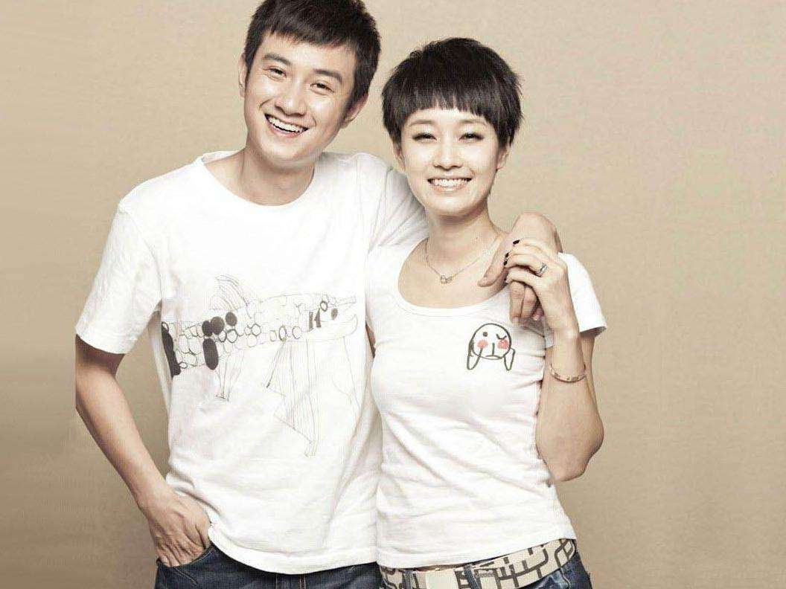

# 文章马伊俐离婚了

知道这个消息是刷新闻的时候突然刷到的，心里瞬间不是滋味，但是我想这个决定双方当事人肯定也是权衡了所有才做出的。

我知道文章马伊俐始于《奋斗》，火于《雪豹》《裸婚时代》，当然同时也认识了另一位—姚笛，当时真的好喜欢他们拍的电视剧，很真实。只是后来众所周知的文章在马伊俐怀二胎时被爆出轨，出轨姚笛！当时我还在上大学，舍友脱口而出文章姚笛本来不就夫妻俩吗？是呀，电视作品拍的太真实源于二人本就有情呀！

我唏嘘文章的做法太不是男人，心疼马伊俐不值得，至于姚笛只是不再喜欢了。当时的文章还很红还很傲，他不服不低头，只是他没有想到他的这个事情会闹的如此沸沸扬扬，而且从此也败坏了粉丝的好感，断送了他的事业。此时他服软了道歉了，我最佩服的还是马伊俐的做法，我以为她会选择离婚，但是也许为了家庭，为了孩子，或者对文章还有感情，她只是在文章的道歉文字发出后回应了“恋爱虽易，结婚不易，且行且珍惜”，而且行且珍惜也成了流行语。我以为自此二人会和好如初，幸福美满。

此后，文章接了《少帅》，但再也没有像《雪豹》那样火了，文章也就转到幕后去了。相反马伊俐的《北上广不相信眼泪》《我的前半生》却很火，并且获得了白玉兰奖最佳女主角奖。只是感觉两人的差距自此拉开了。

文章后来再出现在各种镜头面前的时候都是很低沉，谦卑，内敛，沉淀的，再也没有往昔的开朗活泼了。可能是被贴上出轨的标签后大家总是拿有色的眼光去看待他吧，我个人感觉他的内心是压抑的，是痛苦的，仿佛在诉说着我真的是浪子回头了，为什么大家还是不放过我？一步错，难道真的是步步错吗？

今天，文章说，“吾爱伊利，同行半路，一别两宽，余生漫漫，依然亲情守候”。马伊俐回，“你我深爱过，努力过，彼此成就过。此情有憾，然无对错。往后，各生欢喜。”破镜终究还是无法重圆，也没有什么和好如初。

最后，还是想叹息一下，其实人非圣贤孰能无过，只是这个过错请不要逾越红线，否则即使曾经再深爱的两次人也终将会渐行渐远，留下的只有惋惜！

此文，谨以此感叹我深深喜爱的几位演员！