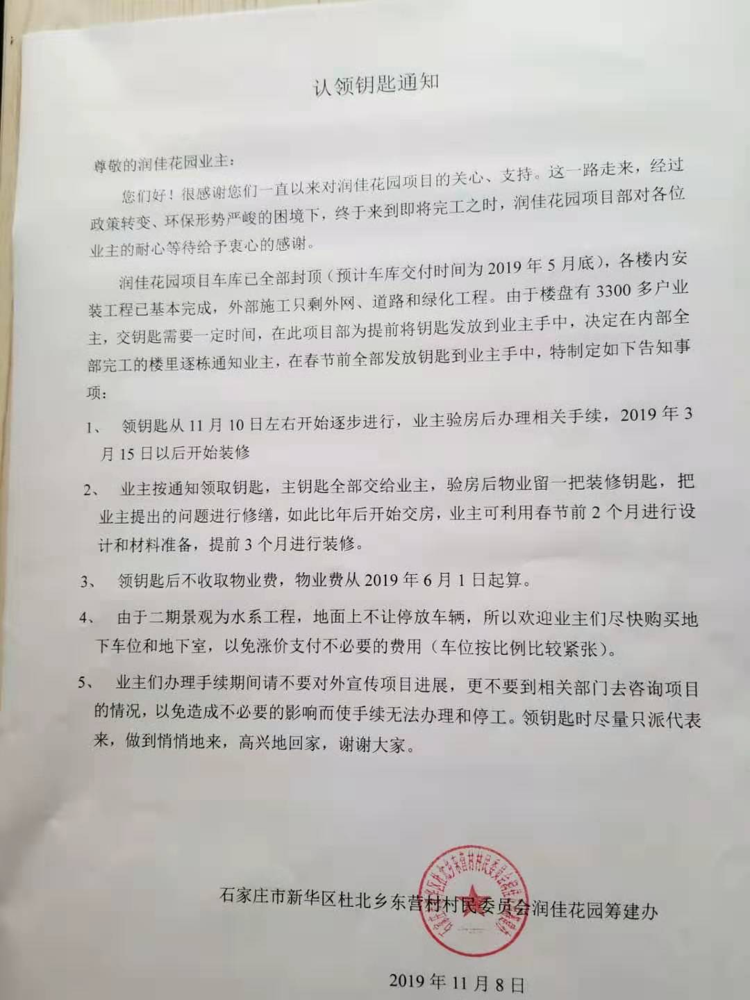
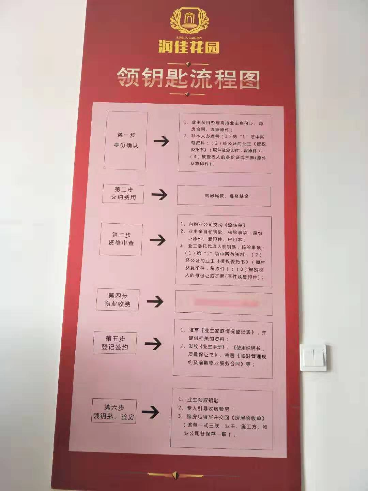
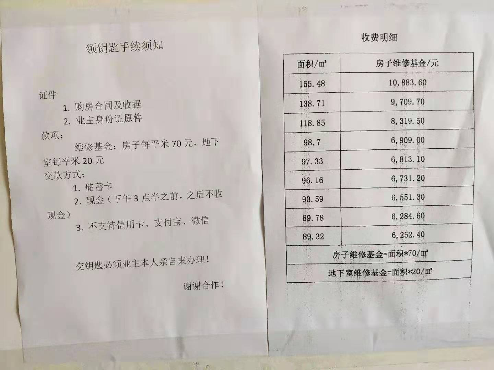
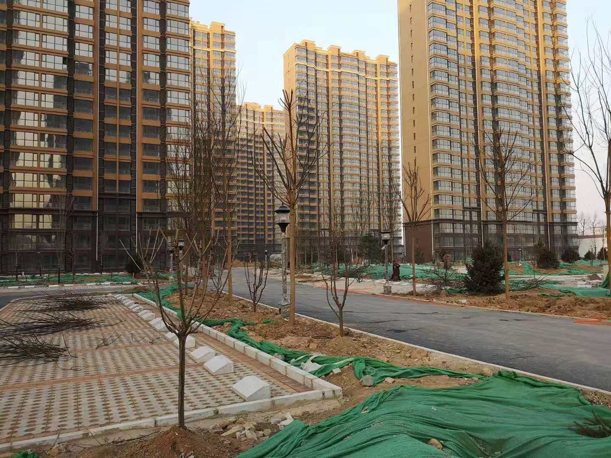

# 润佳花园交房领钥匙流程


润佳花园的交房活动已经从2018年年底热热闹闹的开始了，从相信大家很多人都已经办理完了领取钥匙的手续，我在这里收集了一下领钥匙需要的材料发布给大家，已经领完钥匙的业主可以直接忽略，还未领钥匙的业主可以看看，具体详情还请到润佳花园7号楼2单元101室咨询。

开发商通知：



领钥匙流程：



需要准备的材料：



最后祝大家早日乔迁新居！



另附之前山鸡哥问开发商的9个问题及答复：
```python
今天去谈了9个问题，答复如下:

1.维修基金收取后的存放和使用怎么做到透明公正。答复是:维修基金是村里谈论征求广大村民意见必须收取，也是为日后维修启保障作用。由村委会开户，同物业开发商三方监管，待业主委员会成立后开发商退出业委会进入。由物业按时公示基金状况便于业主们知情监督。

2.房屋面积公摊及补差怎么算。答复：房屋有专业部门测量，结果体现在后期发放的村证上。以证上面积为准随公摊一起公布多退少补。

3.关于承诺3.15通水通电装修问题。答复：承诺必兑现，出书面答复违约措施。

4.承诺二期水系的施工标准及工期。答复：二期水系如效果图无变化，工期70天，无特殊情况6.1日前完工。

5.承诺的市政电和双气。答复：绝对都是市政的设施。（并出示了相关手续，我和其他业主都查验了，不让拍照）

6.合同规定的推迟交房违约金。答复：全体业主一视同仁冲顶三个接口费。有业主说的现在没有接口费了。这个签订合同时是有的，国家取消接口费也有规定有.原来合同上收取接口费的自行处理。所以有赔有赚但都不大，一律冲顶。

7.小区5号楼和11号楼门楼开裂。答复：这两栋楼回填时土没夯实。但是这两栋楼的门楼是后建的和楼体是分开的不影响楼体。并且处理完毕没有问题了。

8.现在交钥匙需要捆绑地下室。回复：是的，合同规定地下室车位由开发商另行通知购买。因为当时没有面积。现在有了，而且闲置很多，交完钥匙都不买那地下室就没有意义和价值了，所以现在领钥匙买地下室。如果有两套房的可以买一个地下室。通知领钥匙买的有优惠，过期来的优惠取消。

9.现在交房条件还不够为什么要交.答复：每天几十户忙到天黑也弄不完，现在交也不敢保证3月15号前能交完，等都来领钥匙等着装修就更耽误事情了。  
```