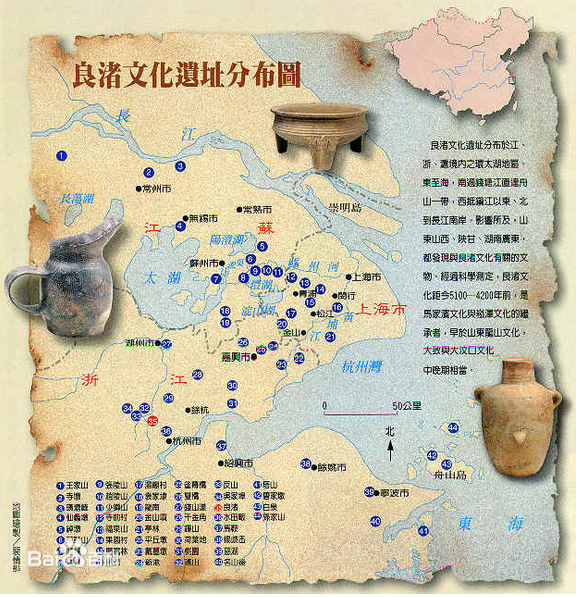
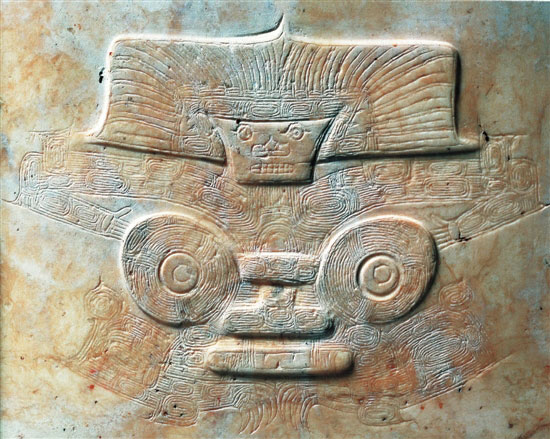

# 良渚文化：比大禹治水还早一千年！
中华文明上下五千年，然而即使是距今4000多年前的大禹治水也只是在神话传说中存在，并没有有力的实物出土。今天要讲述的就是比大禹治水还早一千年距今5300年至4500年前良渚文化，良渚文化不仅出土了多达6万多件的实物，考古人员还发现了规模宏大的水利工程。2019年7月6日，中国良渚古城遗址获准列入世界遗产名录。

## 北纬30度
北纬30度，是一条产生了许多自然景观、人文景观的神奇纬度带。在这条线上，诞生了尼罗河流域的古埃及文明、两河流域的苏美尔文明、印度河流域的哈拉帕文明和长江下游环太湖流域的良渚文明等，它们都留下了悠久灿烂的文化遗产。

## 纪录片推荐
良渚文化纪录片，一共三集，纪录片制作精良，模型、动画、实物拍摄等非常棒。

https://www.youtube.com/watch?v=lGcPnHvTkzc&list=PLmHvcli_9mkQSUpOEUbAN2H4_0JNUz0TY&index=1
https://www.youtube.com/watch?v=jxZIw_QfGjY&list=PLmHvcli_9mkQSUpOEUbAN2H4_0JNUz0TY&index=2
https://www.youtube.com/watch?v=dLCmP0bQ6dI&list=PLmHvcli_9mkQSUpOEUbAN2H4_0JNUz0TY&index=3