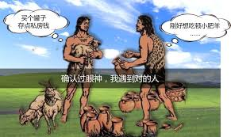
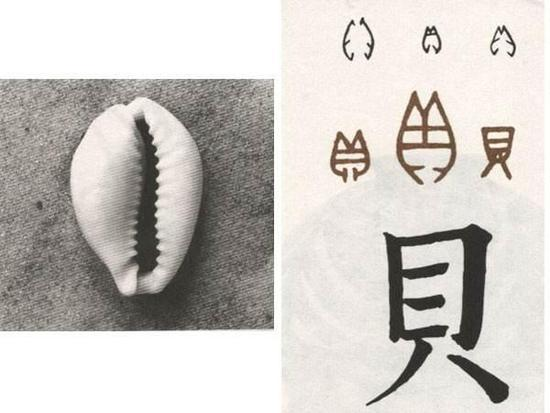
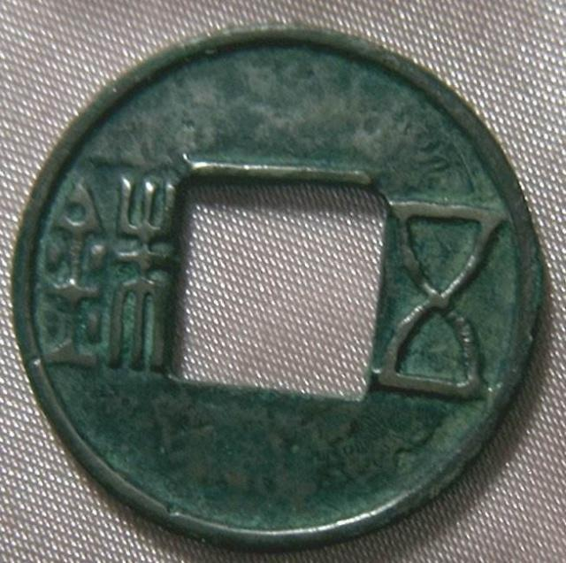

# 货币的起源及发展

### 劳动分工
劳动分工建立以后，每人专司一职操作娴熟度获得提高，从而使劳动生产率获得极大提高。然而一个人劳动的产品只能满足其自身的小部分需求，其他大部分需求需要把自己的劳动产品剩余部分与别人交换而得到满足。这样一来，我们从某种程度来讲都成了商人，而社会也变成了一个商业社会。

### 商品交换
在一个没有货币的社会，我们先来做一个假设：一个人掌握有多余其他人的商品，而另一个人则正好缺少这种商品，那么前者肯定乐于出售而后者也肯定乐于购买，但是问题是后者没有前者想要的东西，所以二者之间不可能进行交换。

### 货币起源
所以为了避免上面的这种不便，在社会发展到某一时期，一些深谋远虑的人在自己的劳动产品之外都会储藏一定的他人不会拒绝与之交换的物品，这种物品就是货币的雏形。

### 货币发展
在原始社会，人们拿牛羊等畜生做过交换的媒介，但这种媒介使用起来相当不方便，比如我某天想买半头牛的东西，但是牛不可能分二半，所以我只能买一整头牛的商品。再后来，有些国家拿贝壳作为交换的媒介并持续了相当长的时间。

不过，世界上的所有国家后来都由于不可抗拒的理由最终选择金属作为媒介而放弃了其他物品。因为金属不像其他物品，金属能够长期保存而毫无磨损、不腐烂、易重新规划大小。不同的国家曾经使用不同的金属作为交换的媒介，铁曾是古斯巴达人的商业媒介；铜曾经是古罗马人的商业媒介；黄金和白银曾是所有富裕和商业发达国家的共同媒介。

金属媒介刚开始时几乎都是很粗糙的锭条，没有任何标记，这样的话如果其成分稍有不同，其价值就有很大差异，所以很多心怀歹意的人就会在其中掺杂其他不值钱的金属。另外，如果一个穷人每次只想买一丁点的商品，那么如何削下这一丁点的金属及称重都是很麻烦的问题。

由于上面的种种原因，以国家为主导的铸币就营运而生了，为了方便交换以及防止欺诈，国家统一铸造钱币并在上面加上一个公印，现代版的货币就出现了。

说到这里多说几句：在中国汉初时曾允许私人铸钱，国家只规定了铸造的铜钱的质量，结果管理不善，导致物价飞涨。于是收拢制币权，并对擅自铸币的不法之徒处以极刑。但是汉文帝又开了口子，只要不降低铜钱的质量，仍然允许私人铸钱。吴王刘濞其封地有铜矿，所以私自大规模铸造钱币，积累的大量的财富，为后来的七国之乱埋下了祸根。汉景帝平七国之乱，再次将铸造权收回中央。汉武帝时很有名的五铢钱开始粉墨登场。

### 纪录片推荐
优酷上搜索《黄金时代》

https://v.youku.com/v_nextstage/id_5caee292c5a911e1b356.html?spm=a2h7l.searchresults.soresults.dposter

