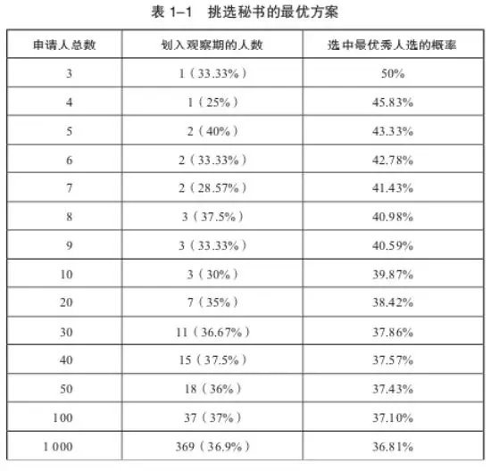

## 数学算法指导你如何找到心仪的对象
先来问你一个问题：假如你可以从18岁谈恋爱，直到35岁结束，每年之内你可以交往一个异性朋友，你怎么找到你生命中的那个ta？是随机选一个？还是乱花渐欲迷人眼之后也做不出判断？今天咱们就从数学角度帮你分析分析这个让无数男男女女纠结的问题。

### 最优停止理论
其实这个问题可以和其他问题比如：租房子、公司招人、甚至小偷偷东西时如何下手等这些问题统一归为一类即所谓：最优停止问题。在这些问题中，最大的难点并不在于选择哪一种方案，而是确定自己需要考虑多少种可选方案。方案少的话，你没啥可纠结的，但是当方案多时，人人都会犯难。

最优停止理论源于所谓【秘书问题】即我是面试官，我要从一堆人选中选择最合适当秘书的那个人，我们一般不会给某个面试者打分，但是在我们心里知道当前面试者是不是比上一个面试者更优秀。秘书问题假设你如果拒绝了某位面试者则不能再改变主意回头选择他。所以，如果你决定将职位给某个面试者，那么后面的面试者肯定没有机会了，而你可能错过后面更优秀的面试者。

我们下面来一步步分析：

1. 当面试者只有一名时，不用纠结，就选他。
2. 当面试者有二名时，无论你选择谁，选到最优秀的人的概率都是50%。
3. 当面试者有三名时，如果随机选择一名，那么选到最优秀的人的概率是1/3也就是33.3%，但是我们如何取得更好的结果呢？关键就要看第二场面试，当我们面试第一个申请者时，他肯定是目前最优秀的，当我们面试最后一名申请者时，我们已经拒绝了前面二名申请者，所以只能选他。但是当我们面试第二名申请者时，我们既掌握了一下信息，又有一些能动性(选或是不选)，我们知道他和第一名面试者谁优谁劣，所以我们做出选择，如果他比第一名面试者优秀，则选择他，否则放弃他。此时我们选择最优秀人的概率是50%！

依次类推，我们可以得出面试者人数和选中最优秀的人的概率关系：

数学证明，采用这种方案我们选中最优秀人选的概率为37%，而且面试者越多，概率越接近37%。

### 需要说明的
采用最优停止理论，你选到最优人选的概率为37%，意味着你仍有63%的概率会选不到最优秀的人，是不是很沮丧？但是它比你随机选择一个选中最优的概率要大很多。如果你要拿此理论来作为找对象的依据，你大概率不能找到那个最优秀的人，这确实是个坏消息，但是最优停止理论能帮你找到相对优秀的并且让你不再纠结。

### 回到今天的问题
你从18岁谈恋爱，直到35岁结束，每年之内你可以交往一个异性朋友。根据最优停止理论：你应该在24.66岁之前保持观望，等过了24.66岁，一旦遇到比前面所有都好的一个ta，你应该马上下手！

### 总结
当然我们实际生活中找对象问题远比这个复杂的多，尤其是现在曾多粥少。最优停止理论只是给你一个指导，当你拿不定主意时，不妨试试它。另外就是可选方案越多时，最优停止理论才更有价值。相比大海捞针总是无功而返，最优停止理论是你最有力的工具。