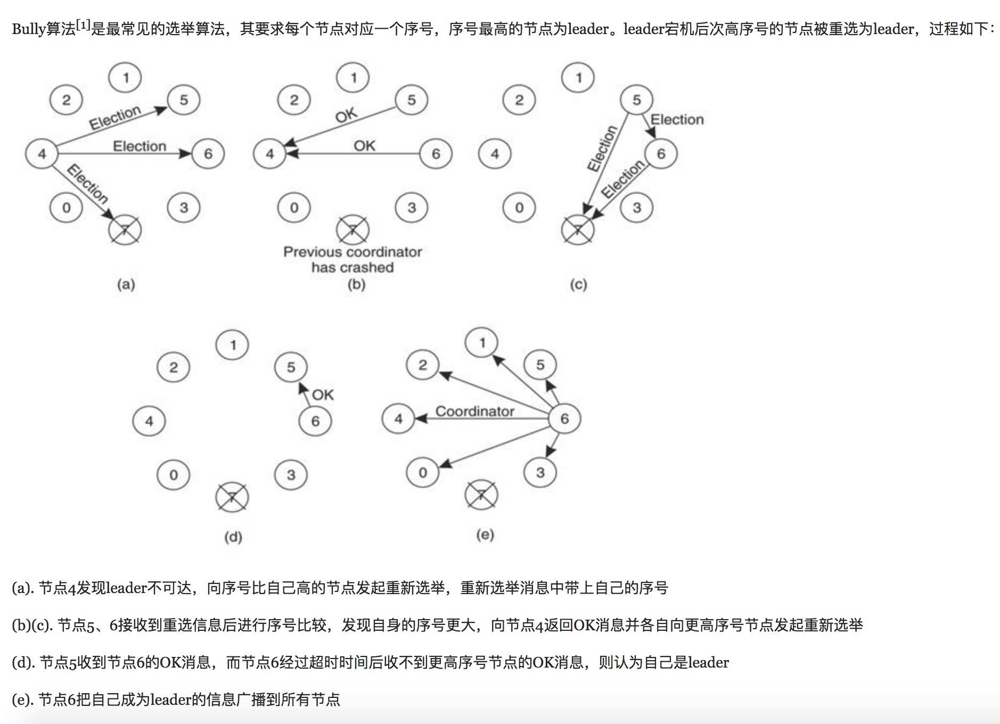

# 分布式系统概念初涉
分布式系统（distributed system）正变得越来越重要，大型网站几乎都是分布式的。分布式系统的最大难点，就是各个节点的状态如何同步。CAP定理是这方面的基本定理，也是理解分布式系统的起点。

## CAP定理
一致性：写一个值后必须返回该值

可用性：每次取一个值必返回其值

分区容忍性：系统要容忍二个子网络之间不能通信的情况

分布式系统的三个指标，分别代表一致性、可用性、分区容忍性。一般来说，分区容错无法避免，因此可以认为 CAP 的 P 总是成立。CAP 定理告诉我们，剩下的 C 和 A 无法同时做到。

## 一致性和可用性的矛盾
一致性和可用性，为什么不可能同时成立？答案很简单，因为可能通信失败（即出现分区容错）。

如果保证 G2 的一致性，那么 G1 必须在写操作时，锁定 G2 的读操作和写操作。只有数据同步后，才能重新开放读写。锁定期间，G2 不能读写，没有可用性不。

如果保证 G2 的可用性，那么势必不能锁定 G2，所以一致性不成立。

综上所述，G2 无法同时做到一致性和可用性。系统设计时只能选择一个目标。如果追求一致性，那么无法保证所有节点的可用性；如果追求所有节点的可用性，那就没法做到一致性。

## leader选举算法
选举算法流程(选id较大的那个作为leader)：

选举开始时，每个节点为自己生成一张投票，推荐自己成为leader，并把投票发送给其它节点，这相当于paxos算法中的proposer角色。接下来，节点启动一个接收线程接收其它节点发送过来的投票，并对选票进行处理，这相当于paxos中的acceptor角色。简单说，节点之间通过这种消息发送（投票），最终选举出leader。

当收到其他它节点的选票之后，会和自己的投票比较，如果比自己的投票好（比如推荐的leader的id更大，选举轮数更新），则更新自己的选票，接下来把收到的选票放在选票列表里（该列表存储了所有节点的投票，是一个key-value结构，key为节点的id，value为该节点的投票）。并再次把自己的投票发送给其它节点。

接下来节点会统计选票列表中每个节点获得的票数，如果有一个节点获得超过半数的选票，则认为该节点是leader。如果本节点就是，则将自身的状态置为leading，表明自己是leader；否则将自己的状态置为following，表明自己是follower。

通过若干轮的消息交换，最终，会有一个节点获得超过一半的选票而成为leader。这种方法的精髓在于，每个节点在不需要获得所有节点的信息（投票结果）的前提下，达成一致意见，选出leader。

## 共识算法
Paxos 和 Raft