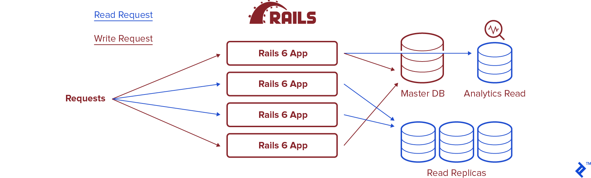

## rails6的新特性介绍
对于rails的粉丝们来说，rails6已经到来，它带来了一堆令人期望的新特性可以增强你的应用并且节省你的开发时间。记住rails6需要Ruby 2.5+。

### rails6中的并行测试
rails6给`ActiveSupport::TestCase`这个类增加了`parallelize`方法，所以你需要在`test_helper.rb`中增加`parallelize(workers: 2)`来指定worker的数量。
或者也可以在命令行这么使用：`PARALLEL_WORKERS=15 rails test OR PARALLEL_WORKERS=15 rspec spec`

另外，对于每个并行的worker，它还增加了如下的钩子函数：
```ruby
class ActiveSupport::TestCase
  parallelize_setup do |worker|
    # setup databases
  end
 
  parallelize_teardown do |worker|
    # cleanup databases
  end
 
  parallelize(workers: :number_of_processors)
end
```

### Action Cable测试
Connection tests：
```ruby
class ApplicationCable::ConnectionTest < ActionCable::Connection::TestCase
  test "connects with params" do

    connect params: { user_id: 42 }
    OR
    cookies.signed[:user_id] = "42"
    connect

    assert_equal connection.user_id, "42"
  end
 
  test "rejects connection without params" do
    assert_reject_connection { connect }
  end
end
```
Channel tests:
```ruby
class ChatChannelTest < ActionCable::Channel::TestCase
  test "subscribes and stream for room" do
    # Simulate a subscription creation by calling `subscribe`
    subscribe room: "15"
 
    # You can access the Channel object via `subscription` in tests
    assert subscription.confirmed?
    assert_has_stream "chat_15"
  end
end
```
Broadcasting to channels tests:
```ruby
# app/jobs/chat_relay_job.rb
class ChatRelayJob < ApplicationJob
  def perform_later(room, message)
    ChatChannel.broadcast_to room, text: message
  end
end
 
# test/jobs/chat_relay_job_test.rb
require 'test_helper'
 
class ChatRelayJobTest < ActiveJob::TestCase
  include ActionCable::TestHelper
 
  test "broadcast message to room" do
    room = rooms(:all)
 
    assert_broadcast_on(ChatChannel.broadcasting_for(room), text: "Hi!") do
      ChatRelayJob.perform_now(room, "Hi!")
    end
  end
end
```

### 批量插入和更新
新增二个方法：insert_all、update_all
```ruby
result = Article.insert_all(
  [
    { id: 1,
      title: 'Handling 1M Requests Per Second',
      author: 'John',
      slug: '1m-req-per-second' },
    #...snip...
  ],
  returning: %w[ id title ],
  unique_by: :index_articles_on_title_and_author
)


result = Article.upsert_all(
  [
    { id: 1, title: 'Handling 1M Requests Per Second', author: 'John', slug: '1m-req-per-second' },
    { id: 1, .... }, # duplicate 'id' here
    { id: 2, .... },
    { id: 3, .... }, # duplicate 'title' and 'author' here
    { id: 4, .... },
    { id: 5, .... }, # duplicate 'slug' here
    { id: 6, .... }
  ]
)
```

### 多数据库支持
rails6自带多数据库支持，由此，读写自动分离：

```ruby
# database.yml
development:
  primary:
    database: my_primary_db
    user: root
  primary_replica:
    database: my_primary_db
    user: ro_user
    replica: true
  animals:
    database: my_animals_db
    user: root
  animals_replica
    database: my_animals_db
    user: ro_user
    replica: true
```
模型需要这样写：
```ruby
class AnimalsModel < ApplicationRecord
  self.abstract_class = true

  connects_to database: { writing: :animals_primary, reading: :animals_replica }
end

class Dog < AnimalsModel
  # connected to both the animals_primary db for writing and the animals_replica for reading
end
```

### Action Mailbox
邮箱

### Zeitwerk
Zeitwerk is the new code loader for Ruby. Given a conventional file structure, Zeitwerk loads your project’s classes and modules on demand, meaning you don’t need to write require calls for your own files. To enable it in Rails 6, you can do the following:

```ruby
config.autoloader = :zeitwerk
```

### 数据库超时设置
下面的语句将会抛出`StatementTimeout`如果时间超时：

```ruby
User.optimizer_hints("MAX_EXECUTION_TIME(5000)").all
```

### 清空所有数据库
`rails db:truncate_all`

### 富文本编辑器Action Text
安装：

```ruby
rails action_text:install

# app/models/message.rb
class Message < ApplicationRecord
  has_rich_text :content
end
```

### rails6中的license code机制，可以控制程序的使用。

[原文链接](https://www.toptal.com/ruby-on-rails/rails-6-features)