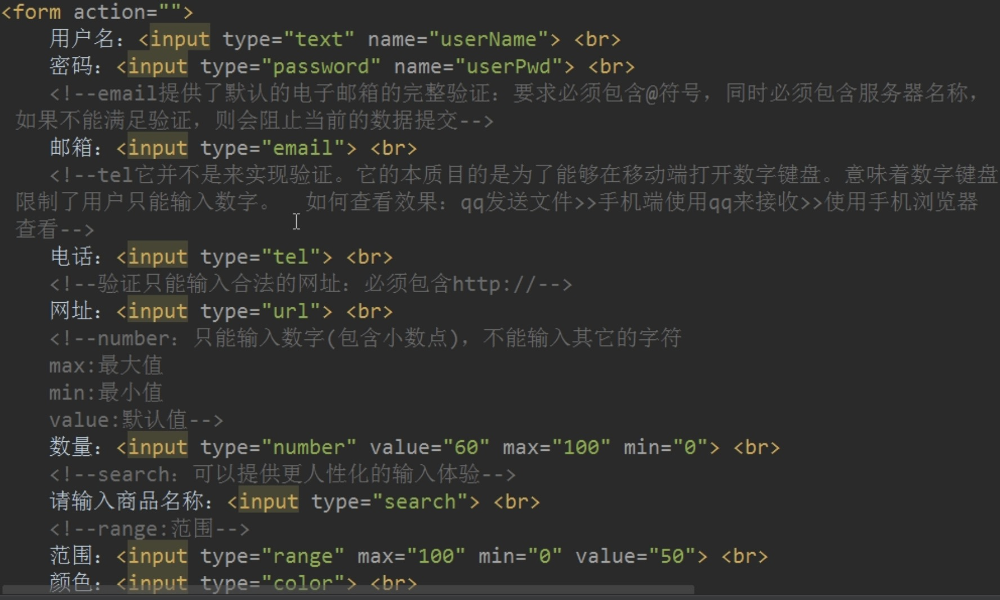

## HTML5-HTML语言的第五版：面向移动端开发
HTML5并不是一门新的语言，而是HTML语言的第五个重大版本更新，今天简要记录一下相对于HTML4有哪些新特性。

### 所有主流浏览器都已支持
HTML5现在基本所有主流浏览器都支持，包括Chrome、Firefox、Safari，现在连微软的edge浏览器都要用chrome内了。另外，IE9及以上支持HTML5，IE8及以下不支持html5。

### 文档交互方式的改变
新增video、audio、canvas等多媒体和画图标签。

### 新特性
语义特性、本地存储、网页多媒体、二维三维、特效(过度、动画等)

### 相对于HTML4
进步：抛弃了一些不合理不常用的标记和属性。

表单：新增了一些标记和属性

简洁：从代码角度而言，更简洁。

### HTML5新增布局标签


### IE8及以下怎么兼容HTML5
引入script：html5shiv.min.js

### 表单新增属性type
email：提供了对邮箱是否合法的完整验证

tel：并不提供电话号码验证，而是为了在移动端打开数字键盘。

url：验证是否是合法网址

number：验证是否是数字，并且提供+1或者-1的按钮，并且可以设置min、max、default的值。

search：提供更人性化的输入体验，输入内容后，有一个全删的×号。

range：设置范围，比如音量范围。

color：颜色摄取器

time：时间输入

date：日历控件

datetime：现在大多数浏览器都不支持这个

datetime-local：日期、时间选择器

month：月份选择

week：星期选择




### 表单新增其他属性
placeholder：提示信息

autofocus：自动获取焦点

autocomplete：on打开 off关闭
autocomplete生效必须有二个前提：
1.必须成功提交过
2.当前元素必须有name属性

required：必须填写

pattern：正则表达式验证

file：文件上传，multiple属性可以选择多个文件


### 新增表单事件
oninput：当输入框内容修改时触发

onkeyup：当键盘键弹起时触发

oninvalid：当验证不通过时触发


### 进度条progress


### 音频视频标签
audio：音频

video：视频

video只需设置宽度或者高度就行，浏览器会自动等比例缩放，如果都设置，则并不会起作用。

共有的属性：src controls autoplay loop


### dom选择器
document.getElementByID

document.getElementByTagName

document.querySelector

document.querySelectorAll

### 元素的classList常用方法
add：给当前元素增加class类

remove：当前元素移除class类

toggle：如果当前元素没有要加的class类则增加，如果有要加入的class类则移除

contains：当前元素是否包含某class

item：从下标0索引开始获取class


### HTML5自定义属性


### HTML5网络连接断开监听


### 全屏接口的使用


### fileReader的使用：文件上传时即时预览


### 拖拽事件：ondrag
```html
<!-- 元素可被拖拽声明 -->
<div id="div1">
    <p draggable="true">我可以被拖拽</p>
</div>
```


### 获取地理位置接口
